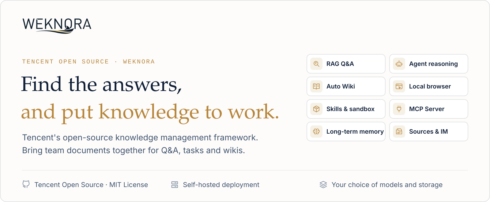
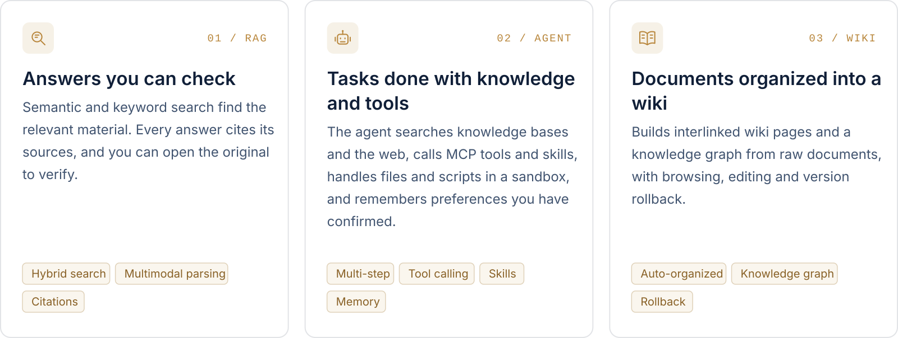
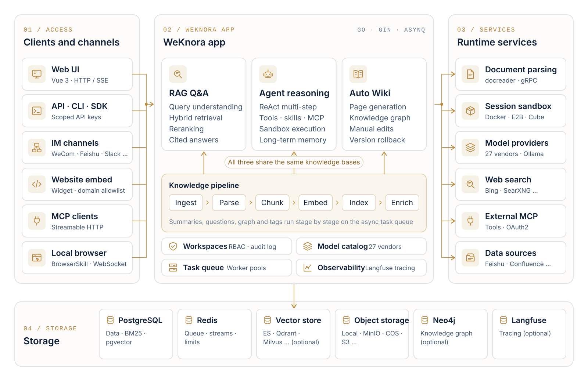

<p align="center">
  <a href="https://weknora.weixin.qq.com">
    <picture>
      <source media="(prefers-color-scheme: dark)" srcset="./docs/images/readme/hero-en-dark.svg">
      
    </picture>
  </a>
</p>

<p align="center">
  <a href="https://weknora.weixin.qq.com"></a>
  <a href="https://weknora.weixin.qq.com/docs/"></a>
  <a href="./CHANGELOG.md"></a>
  <a href="./LICENSE"></a>
  <a href="https://github.com/Tencent/WeKnora/stargazers"></a>
  <br/>
  <a href="https://chatbot.weixin.qq.com"></a>
  <a href="https://chromewebstore.google.com/detail/jpemjbopikggjlmikmclgbmkhhopjdgd"></a>
  <a href="https://clawhub.ai/lyingbug/weknora"></a>
  <a href="https://www.npmjs.com/package/@wxg-prc-cpg/dsh-weknora"></a>
</p>

<p align="center">
  <b>English</b> · <a href="./README_CN.md">简体中文</a> · <a href="./README_JA.md">日本語</a> · <a href="./README_KO.md">한국어</a>
</p>

<p align="center">
  <a href="#overview">Overview</a> ·
  <a href="#quick-start">Quick Start</a> ·
  <a href="#whats-new">What's New</a> ·
  <a href="#features">Features</a> ·
  <a href="#clients-and-integrations">Clients</a> ·
  <a href="#documentation">Docs</a> ·
  <a href="#development">Development</a>
</p>

<p align="center">
  <a href="https://trendshift.io/repositories/15289"></a>
</p>

## Overview

[WeKnora](https://weknora.weixin.qq.com) is an open-source, LLM-powered knowledge framework for enterprise document understanding, semantic retrieval and reasoning. It brings a team's documents together so they can be searched, reasoned over and kept up to date.

https://github.com/user-attachments/assets/19b28ce2-a62f-4f54-b289-c983576259bc

<p align="center"><sub>2:25 · 1080p · English narration and captions</sub></p>

Use RAG to look things up, the agent for multi-step tasks, and the wiki to organize knowledge. All three work on the same knowledge bases.

<picture>
  <source media="(prefers-color-scheme: dark)" srcset="./docs/images/readme/capabilities-en-dark.svg">
  
</picture>

Beyond the three modes:

- **Memory and curation**: cross-session long-term memory keeps the profile, preferences and facts a user has confirmed. Folder uploads keep their directory tree, and retrieval chunks can be edited, diffed and rolled back.
- **Data sources and formats**: auto-sync from Feishu wiki / Feishu Drive / Confluence / GitLab / Tencent IMA / Notion / Yuque / DingTalk Docs / RSS, with more on the way. 10+ document formats including PDF, Word, images, Excel and XMind; Office files are parsed in-process by anydoc.
- **Channels and integrations**: Q&A in WeCom, Feishu, Slack, Telegram and other IM apps; an embed widget for external websites; a built-in MCP Server for Cursor, Claude and other AI tools; scoped API keys with a principal model for programmatic access.
- **Models**: 27 built-in vendors with a generated model catalog, including OpenAI, DeepSeek, Qwen (Alibaba Cloud), Zhipu, Hunyuan, Gemini, MiniMax, NVIDIA, LiteLLM and Ollama.
- **Permissions and operations**: multi-workspace RBAC (four roles, per-resource ownership, per-workspace audit log), several storage instances per workspace, a runtime task-queue dashboard with worker-pool governance, and Langfuse tracing for agent steps, token usage and pipelines.
- **Deployment**: LLMs, vector databases and storage backends are all swappable. Deploy locally or on a private cloud and keep the data in your own environment.

## Quick Start

<table>
  <tr>
    <td width="33%" valign="top">
      <br/>
      <sub>ONLINE</sub><br/>
      <b>WeChat Dialog Open Platform</b><br/>
      Manage knowledge bases online and connect Q&A to Official Accounts, Mini Programs and other WeChat scenarios.<br/><br/>
      <a href="https://chatbot.weixin.qq.com/login">Open the platform →</a>
    </td>
    <td width="33%" valign="top">
      <br/>
      <sub>CLOUD</sub><br/>
      <b>Tencent Cloud Lighthouse</b><br/>
      Deploy WeKnora from an application template and run it on your own cloud server.<br/><br/>
      <a href="https://mc.tencent.com/s69nKCVz">Deploy on Tencent Cloud →</a>
    </td>
    <td width="33%" valign="top">
      <br/>
      <sub>SELF-HOSTED</sub><br/>
      <b>Your own environment</b><br/>
      Deploy with Docker or Kubernetes and configure models, storage and networking yourself.<br/><br/>
      <a href="#run-with-docker-compose">Run with Docker Compose ↓</a>
    </td>
  </tr>
</table>

### Run with Docker Compose

Requires [Docker](https://www.docker.com/), [Docker Compose](https://docs.docker.com/compose/) and [Git](https://git-scm.com/).

```bash
git clone https://github.com/Tencent/WeKnora.git
cd WeKnora
cp .env.example .env    # Edit .env as needed, see comments in the file
docker compose pull     # Pull the latest images
docker compose up -d    # Start core services
```

Then open **http://localhost** and follow the onboarding guide. A walkthrough with sample data is in the [Quickstart](https://weknora.weixin.qq.com/docs/01-getting-started/03-quickstart).

> [!TIP]
> To use a local Ollama model, run `ollama serve > /dev/null 2>&1 &` first. For the Ollama embedding model name, `OLLAMA_BASE_URL`, and RAM notes, see [Configuration](https://weknora.weixin.qq.com/docs/01-getting-started/04-configuration).

| Service | URL |
|---------|-----|
| Web UI | `http://localhost` |
| Backend API | `http://localhost:8080` |
| Langfuse Tracing | `http://localhost:3000` |

### Optional services

Add `--profile` flags to enable additional components; multiple profiles can be combined.

| Profile | Adds |
|---------|------|
| _(default)_ | Core services |
| `full` | All features |
| `neo4j` | Knowledge Graph (Neo4j) |
| `minio` | Object Storage (MinIO) |
| `langfuse` | Tracing (Langfuse) |

```bash
docker compose --profile neo4j --profile minio pull
docker compose --profile neo4j --profile minio up -d
docker compose down     # Stop services
```

### Upgrading

If you already have WeKnora running and downloaded a newer release:

```bash
# Set WEKNORA_VERSION in .env to the target release (e.g. 0.8.2), or keep latest
docker compose pull     # Pull images matching WEKNORA_VERSION
docker compose up -d    # Recreate containers with new images
```

> [!NOTE]
> `docker compose up -d` alone reuses locally cached images and may leave the UI version out of sync with the release you downloaded. Read the [upgrade notes](https://weknora.weixin.qq.com/docs/07-releases/v0.8.2#upgrade-notes) before moving from v0.8.0.

### Other ways to deploy

| Option | When to use it |
|--------|----------------|
| **Docker Compose** | The standard deployment above: all features, multiple services |
| **Kubernetes (Helm)** | Production clusters; the chart is in [`helm/`](./helm) |
| **Lite single binary** | Local or low-resource use with no external dependencies (SQLite + in-memory queue); see [Lite vs. standard](./docs/LITE.md) |
| **Desktop app** | The Lite runtime with a GUI, login-free start and a macOS host sandbox; no installer is published yet, so build it from source |

All options, hardware requirements and deployment topologies: [Installation guide](https://weknora.weixin.qq.com/docs/01-getting-started/02-installation).

> [!WARNING]
> WeKnora ships with login authentication, but for production deployments we strongly recommend that you:
> - deploy it in an internal / private network rather than on the public internet;
> - avoid exposing the service directly to public networks, to prevent information leakage;
> - configure proper firewall rules and access controls for the deployment environment;
> - regularly update to the latest version for security patches and improvements.

## What's New

### v0.8.2 <sub>· 2026-09-24 · [release notes](https://weknora.weixin.qq.com/docs/07-releases/v0.8.2)</sub>

Agents can operate the browser on your computer, knowledge bases can be published to other AI tools over MCP, and a running conversation can be steered, forked or rewound.

<table>
  <tr>
    <td width="33%" valign="top"><br/><b>Operate the browser on your computer</b></td>
    <td width="33%" valign="top"><br/><b>Publish knowledge bases to other AI tools</b></td>
    <td width="33%" valign="top"><br/><b>Adjust a conversation while it runs</b></td>
  </tr>
</table>

- **[Local Browser (BrowserSkill)](https://weknora.weixin.qq.com/docs/07-releases/v0.8.2#local-browser)**: agents drive the user's own Chrome / Edge through the open-source BrowserSkill extension, with a live task preview, pause / resume and hand-off for logins and CAPTCHAs.
- **[Built-in MCP Server](https://weknora.weixin.qq.com/docs/07-releases/v0.8.2#mcp-server)**: per-workspace `/mcp/<endpoint_id>` endpoints over Streamable HTTP, each with its own token, knowledge-base scope, rate limit and tool groups. The Python `mcp-server/` is deprecated.
- **[Conversation control](https://weknora.weixin.qq.com/docs/07-releases/v0.8.2#conversation-control)**: append requirements to a running turn, fork from any earlier question, rewind in place with sandbox checkpoints, and pick reasoning effort per session. Generated files are collected in a new artifacts library.
- **[Sandbox](https://weknora.weixin.qq.com/docs/07-releases/v0.8.2#sandbox)**: interactive terminal and graphical desktop; macOS Lite host sandbox with project folders; a sidebar Toolbox for skills, MCP services and the browser connection.
- **[Models](https://weknora.weixin.qq.com/docs/07-releases/v0.8.2#models)**: rebuilt model catalog (27 built-in vendors with generated context-window, max-output, reasoning and vision metadata). Agent retrieval tools are consolidated into `search_knowledge` / `read_document` / `list_documents`.
- **[Knowledge and platform](https://weknora.weixin.qq.com/docs/07-releases/v0.8.2#knowledge)**: Confluence and DingTalk Docs data sources; Bocha and Serply web search; Japanese UI; per-channel IM reply language; whitelist-only outbound mode.

> [!IMPORTANT]
> **Breaking:** DingTalk channels are Stream-only, and sandbox commands run as `root`. See the [upgrade notes](https://weknora.weixin.qq.com/docs/07-releases/v0.8.2#upgrade-notes).

### v0.8.0 <sub>· [release notes](https://weknora.weixin.qq.com/docs/07-releases/v0.8.0)</sub>

- **Skill sandbox runtime**: session-persistent Docker / E2B / Cube backends with per-tenant network policy; the Local host-process backend is removed and Docker is opt-in.
- **Tenant skill catalog**: install from ClawHub / SkillHub / git / zip, with per-sandbox snapshots, live progress, file browse/edit, and personal and workspace env vars.
- **Cross-session long-term memory**: profile / preference / fact / task / interest, auto-extracted with user confirmation, plus `search_memory`.
- **Parsing and sources**: in-process anydoc office parser; GitLab and Tencent IMA data sources; XMind parsing.
- **Ecosystem**: official DeepSeek Harness plugin `@wxg-prc-cpg/dsh-weknora`; LiteLLM; Exa and Metaso web search.
- **Chat**: chat artifacts, question outline and timestamps; context compaction and provider prompt-cache markers.
- **Security**: OIDC JWKS verification, optional complex passwords, document auto-tagging, and broad sandbox/security hardening.

<details>
<summary><b>Earlier releases (v0.2.0 – v0.7.2)</b></summary>

<br/>

- **v0.7.2** — Launched the **official product documentation site** (VitePress; six sections, ~50 pages covering ~360 API endpoints and ~150 environment variables, with standalone Docker/Nginx deployment, quickstart sample data and a local MCP demo); **knowledge base folder tree** (upload paths stored as first-class data, browse/rename/re-file documents like a file manager); **chunk editing with revision history** (edit retrieval chunks in the UI, per-version diff and rollback, automatic reindexing, plus custom document metadata); **Wiki page revision history** (snapshots + line-level diff + one-click rollback + in-browser manual editing); **directly loadable file URLs** via `resource_urls=public` / `RESOURCE_URL_MODE` (third-party apps render images and files without a second authenticated proxy call); **Feishu Drive data source** and docx sync through the blocks API; batch document tagging; **MCP Server 1.1.x** (migrated to the mcp 2.x high-level API, official PyPI package `tencent-weknora-mcp`, new `create_knowledge_from_text` and `list_shared_knowledge_bases` for 29 tools total); AWS S3 default credential chain (IAM Role / IRSA); local HTML upload parsing; QQBot markdown replies; new PR CI checks for app / frontend / docreader / mcp-server. Plus large-scale router and `modelcontext` refactors, rerank and chunking quality work, and broad stability fixes.
- **v0.7.1** — New **Yunzhijia (云之家) IM integration** (WebSocket + image messages + markdown replies); **Volcengine rerank** provider (with request batching) and **Zhipu AI web search** provider; **platform-scoped API keys** for control-plane automation (tenant management, system settings, runtime queues, audit logs); **per-KB activity audit trail**; FAQ management enhancements (filtering, tagging, export, import tracking); **Langfuse OTLP/OTel tracing** migration with W3C traceparent propagation; chat header actions with one-click **Markdown export** and wiki tool results in the references drawer; prompt-cache observability; session channel governance (admin-scoped IM/embed/API sessions); resilient Feishu large-wiki sync; and removal of the legacy Neo4j conversation-memory dependency. Plus broad slug-integrity, SSRF-transport, and state-sync hardening.
- **v0.7.0** — Fine-grained **scoped API keys & principal model** (capability-level grants + per-KB restriction + API integration playground); **runtime task-queue observability dashboard & worker-pool governance** (per-stage pools + per-model concurrency governors + failed-task inspection/retry); **multi-instance storage backends** (multiple storage instances per workspace, per-KB binding, default instance); **session-scoped temporary attachments** (async image/doc parsing + combined limits); question & follow-up suggestions; stable resource registry with LLM-context alias compaction; `@Skill / @MCP` mentions with scoped agent runtime; mid-conversation MCP OAuth; QQBot & Lark (Feishu International) IM integration; Redis TLS; Requesty model provider + Keenable web search; tenantless provisioning & gated self-service workspaces; admin password reset; knowledge base duplicate flow; `weknora` CLI v0.10. Plus broad security hardening (SSRF, secret redaction, SQL validation, IDOR).
- **v0.6.3** — Website embed widget & Integrations Center (secure-mode token exchange + rate limits); chat experience overhaul (citation popovers, RAG pipeline progress, streaming markdown); document multi-tag & batch reparse; Wiki folders & hierarchy navigation; RSS data source; MCP OAuth2; EPUB / MHTML parsing; agent model-readiness checks; model test debugger; session source filter; workspace deletion UI.
- **v0.6.2** — Per-upload process configuration with upload-confirm dialog; document reparse with `process_config`; `weknora` CLI v0.9 (bundled Agent Skills, `session stop`, auth/profile harmonization); KB marquee multi-select; HNSW index for 1024-dim pgvector embeddings; chat resources store refactor; Langfuse-only tracing (Jaeger removed).
- **v0.6.1** — Document parsing trace timeline (Langfuse-style span tree with stage-by-stage progress + stop-parse); OpenSearch vector store driver; declarative built-in models via YAML; system admin & consolidated platform settings + audit log; new-user onboarding guide; settings UI redesign; `weknora` CLI v0.7 / v0.8 (agent-first wire contract, NDJSON, `--dry-run`); OpenDataLoader + PaddleOCR-VL parsers; MCP server multi-transport (stdio / SSE / HTTP); per-model thinking-mode config; Tencent LKEAP rerank + native Gemini embeddings + MiniMax-M3.
- **v0.6.0** — Workspace RBAC (4-tier role matrix `Owner` / `Admin` / `Contributor` / `Viewer` + per-KB ownership + per-workspace audit log), workspace member management & multi-workspace UX, self-service workspaces; `weknora` CLI v0.4 GA with `mcp serve`; KB retrieval fan-out across vector stores; AES-256-GCM credential encryption + docreader gRPC TLS + Token; Zhipu embedder + Huawei OBS; server-side user preferences; Go 1.26.0. See [Tenants & auth](https://weknora.weixin.qq.com/docs/03-features/01-tenant-auth).
- **v0.5.2** — Wiki ingest scales to 40k-document KBs (task queue + DLQ); MCP human-in-the-loop tool approval; Anthropic / Apache Doris / Tencent VectorDB / KS3 / SearXNG backends; adaptive 3-tier chunking with live preview; global ⌘K command palette; Yuque connector + WeChat Mini Program; `weknora` CLI preview.
- **v0.5.1** — Knowledge-base batch management; workspace-wide IM channels overview; session search + user-scoped pinning; unified Model / Web Search / MCP settings cards; per-agent LLM timeout; desktop workspace switching.
- **v0.5.0** — Wiki Mode GA — agents auto-generate structured, interlinked Markdown wiki pages with a knowledge graph; wiki browser + visual graph in the UI.
- **v0.4.0** — WeKnora Cloud (hosted LLM + parsing); Chrome Extension; ClawHub Skill; WeChat IM; attachment processing; Azure OpenAI / Alibaba OSS; Notion connector; Baidu + Ollama web search; VectorStore management.
- **v0.3.6** — ASR (audio); Feishu data-source auto-sync; OIDC; IM quote-reply context + thread-based sessions; document summarization; Tavily search; parallel tool calling; agent @mention scope restriction.
- **v0.3.5** — Telegram / DingTalk / Mattermost IM; IM slash commands + QA queue; suggested questions; VLM auto-describe MCP tool images; Novita AI; channel tracking.
- **v0.3.4** — WeCom / Feishu / Slack IM; multimodal image support; NVIDIA model API; Weaviate; AWS S3; AES-256-GCM API-key encryption; built-in MCP service; hybrid-search optimization; `final_answer` tool.
- **v0.3.3** — Parent-child chunking; KB pinning; fallback response; passage cleaning for rerank; storage auto-creation; Milvus.
- **v0.3.2** — Knowledge Search entry; per-source parser & storage engine config; image rendering in local storage; document preview; Volcengine TOS; Mermaid rendering; batch session management; memory graph preview.
- **v0.3.0** — Shared Space; Agent Skills + sandboxed execution; custom agents; Data Analyst agent; thinking mode; Bing / Google web search; API Key auth; Helm chart; Korean i18n; Qdrant.
- **v0.2.0** — Agent Mode (ReACT); multi-type knowledge bases (FAQ + document); conversation strategy config; DuckDuckGo web search; MCP tool integration; new UI with agent mode switching; MQ async task management.

Full history: [`CHANGELOG.md`](./CHANGELOG.md).

</details>

## Product Tour

### Quick Q&A and smart reasoning

**Two ways to ask.** Quick Q&A answers from the knowledge base with RAG and cites the sources it used. In smart reasoning the agent plans multi-step work, searching, reading documents and calling tools and skills, and shows each step in the conversation. [Docs →](https://weknora.weixin.qq.com/docs/03-features/18-chat-experience)

<a href="./docs/images/readme/spotlight-qa-light.webp">
<picture>
  <source media="(prefers-color-scheme: dark)" srcset="./docs/images/readme/spotlight-qa-dark.webp">
  
</picture>
</a>

### Local browser

**Operate the browser on your computer.** Through Tencent's open-source BrowserSkill extension, the agent opens pages and fills in forms in your own Chrome or Edge, and hands over to you for logins and CAPTCHAs. [Docs →](https://weknora.weixin.qq.com/docs/05-clients/09-local-browser)

<a href="./docs/images/readme/spotlight-browser-light.webp">
<picture>
  <source media="(prefers-color-scheme: dark)" srcset="./docs/images/readme/spotlight-browser-dark.webp">
  
</picture>
</a>

### Skills and sandbox

**Run skills and produce files.** Docker, E2B and Cube backends are supported. Turns in the same session share one workspace, and generated files can be previewed and downloaded. Open the graphical desktop or interactive terminal beside the chat to follow each step and take over when needed. [Docs →](https://weknora.weixin.qq.com/docs/03-features/22-skills-sandbox)

<a href="./docs/images/readme/spotlight-sandbox-light.webp">
<picture>
  <source media="(prefers-color-scheme: dark)" srcset="./docs/images/readme/spotlight-sandbox-dark.webp">
  
</picture>
</a>

### Toolbox: MCP services and skills

**Tools the agent can use.** Connect external MCP services and choose, tool by tool, which are enabled and which calls need approval. Install skills from ClawHub, SkillHub, Git or ZIP, manage them per workspace, and reuse them across sandboxes. [Docs →](https://weknora.weixin.qq.com/docs/03-features/22-skills-sandbox)

<a href="./docs/images/readme/spotlight-toolbox-light.webp">
<picture>
  <source media="(prefers-color-scheme: dark)" srcset="./docs/images/readme/spotlight-toolbox-dark.webp">
  
</picture>
</a>

### Automatic wiki

**Documents organized into a browsable wiki.** With Wiki enabled, WeKnora extracts people, products and concepts from knowledge-base documents into pages with source citations, organized by directory. The knowledge graph shows how pages relate; pages can be edited directly and every change can be rolled back. [Docs →](https://weknora.weixin.qq.com/docs/03-features/14-wiki)

<a href="./docs/images/readme/spotlight-wiki-light.webp">
<picture>
  <source media="(prefers-color-scheme: dark)" srcset="./docs/images/readme/spotlight-wiki-dark.webp">
  
</picture>
</a>

### Observability

**Tracing and runtime monitoring.** Langfuse traces the reasoning, tool calls and token usage of each agent step. The document parsing timeline shows progress stage by stage, and the task-queue dashboard lists queued and failed tasks. [Docs →](https://weknora.weixin.qq.com/docs/03-features/16-observability)

<a href="./docs/images/readme/spotlight-observability-light.webp">
<picture>
  <source media="(prefers-color-scheme: dark)" srcset="./docs/images/readme/spotlight-observability-dark.webp">
  
</picture>
</a>

## Architecture

<a href="./docs/images/readme/architecture-en-light.svg">
<picture>
  <source media="(prefers-color-scheme: dark)" srcset="./docs/images/readme/architecture-en-dark.svg">
  
</picture>
</a>

A modular pipeline from document parsing, vectorization and retrieval to LLM inference, in which every component can be replaced or extended. It runs locally or on a private cloud, and the Web UI needs no setup to get started. More: [Architecture overview](https://weknora.weixin.qq.com/docs/02-architecture/01-overview) · [RAG pipeline](https://weknora.weixin.qq.com/docs/02-architecture/04-rag-pipeline) · [Extension points](https://weknora.weixin.qq.com/docs/06-development/03-extension-points).

## Features

### Intelligent Conversation

<sub>Docs: [Agent](https://weknora.weixin.qq.com/docs/03-features/07-agent) · [Wiki](https://weknora.weixin.qq.com/docs/03-features/14-wiki) · [Skills & sandbox](https://weknora.weixin.qq.com/docs/03-features/22-skills-sandbox) · [Memory](https://weknora.weixin.qq.com/docs/03-features/23-memory) · [Chat experience](https://weknora.weixin.qq.com/docs/03-features/18-chat-experience)</sub>

| Capability | Details |
|------------|---------|
| Intelligent Reasoning | ReACT progressive multi-step reasoning, autonomously orchestrating knowledge retrieval, MCP tools, skill sandboxes, the local browser, and web search |
| Quick Q&A | RAG-based Q&A over knowledge bases for fast and accurate answers |
| Wiki Mode | Agent-driven auto-generation of structured, interlinked Markdown Wiki pages from raw documents; in-browser manual editing, page revision history, line-level diff and one-click rollback |
| Skill Catalog & Sandbox | Workspace skill catalog (ClawHub / SkillHub / git / zip) installed onto session-persistent Docker / E2B / Cube sandboxes · `shell_exec`, file tools, artifacts, per-config network policy · interactive terminal and browser-based graphical desktop beside the chat · the macOS desktop app runs sessions without a pinned sandbox in an OS sandbox (Seatbelt), bound to a chosen project folder or a dated temporary workspace · Local host-process backend removed |
| Local Browser | Agents drive the user's own Chrome / Edge through the open-source BrowserSkill extension in a dedicated task window (open pages, click, fill forms, read content), with a live preview, pause / resume / end, and hand-off to the user for logins and CAPTCHAs |
| Conversation Control | Append requirements to a running turn, fork a conversation from any earlier question, rewind in place (resetting the sandbox workspace to the matching checkpoint), and choose reasoning effort per session |
| Artifacts Library | A sidebar page listing every generated file across conversations, with type filters, search, date grouping and version history |
| Long-term Memory | Cross-session memory (profile / preference / fact / task / interest) with auto-extract, user confirm, and on-demand `search_memory` |
| Tool Calling | Built-in tools, MCP tools (incl. OAuth2 remote services, mid-conversation OAuth), web search · `@Skill / @MCP` mentions scope the agent runtime per turn · MCP tools are discovered and called on demand and can be enabled per tool |
| Conversation Strategy | Online Prompt editing, retrieval threshold tuning, multi-turn context awareness, per-agent citation output toggle |
| Suggested Questions | Auto-generated question suggestions and after-answer follow-ups based on knowledge base content |
| Temporary Attachments | Session-scoped image / document uploads with async parsing for one-off Q&A, with a combined image + attachment limit |
| Citations & RAG Progress | Inline citation popovers and a references drawer (web / KB source distinction), shared markdown rendering, and stage-by-stage RAG pipeline progress in chat |
| Session Management | Filter and group sidebar sessions by source (Web / IM / Embed), with inline session-title rename |

### Knowledge Management

<sub>Docs: [Knowledge bases](https://weknora.weixin.qq.com/docs/03-features/02-knowledge-base) · [Parsing](https://weknora.weixin.qq.com/docs/03-features/03-document-parsing) · [Chunking](https://weknora.weixin.qq.com/docs/03-features/04-chunking) · [Retrieval](https://weknora.weixin.qq.com/docs/03-features/05-retrieval-engines) · [Knowledge graph](https://weknora.weixin.qq.com/docs/03-features/09-knowledge-graph) · [Data sources](https://weknora.weixin.qq.com/docs/03-features/10-datasource)</sub>

| Capability | Details |
|------------|---------|
| Knowledge Base Types | FAQ / Document / Wiki with folder import, URL import, multi-tag management, and online entry |
| Folder Tree | Folder uploads keep their original directory structure, with a sidebar tree for browsing, folder rename, and re-filing documents into another folder |
| Chunk Editing & Revisions | Edit retrieval chunks directly in the UI with per-version snapshots, diff and one-click rollback, and automatic reindexing after an edit · generated questions can be added, edited, deleted and regenerated · custom document metadata |
| Per-Upload Process Config | Override parser, chunking, multimodal (VLM / ASR), graph extraction, and question generation per upload batch via the upload-confirm dialog or `process_config` API; reparse with new settings |
| Batch Reparse | Re-queue parsing for multiple documents at once with optional per-batch `process_config` |
| Data Source Import | Auto-sync from Feishu wiki / Feishu Drive / Lark / Confluence / GitLab / Tencent IMA / Notion / Yuque / DingTalk Docs / RSS feeds (more coming soon); incremental and full sync |
| Document Formats | PDF / Word / Txt / Markdown / HTML / EPUB / MHTML / Images / CSV / Excel / PPT / JSON / XMind |
| Auto-Tagging | After parse, pick matching tags from the knowledge base's existing set without creating tags or overwriting manual ones |
| Retrieval Strategies | BM25 sparse / Dense retrieval / GraphRAG / parent-child chunking / HNSW-accelerated pgvector (1024-dim) / multi-dimensional indexing |
| Knowledge Graph | Turns documents into a graph of relationships between passages, giving indexing and retrieval structured support for more relevant, broader results (requires Neo4j: start the `neo4j` profile and set `NEO4J_ENABLE=true`) |
| Batch Selection & Tagging | Marquee drag-select multiple documents in the KB list for batch reparse and batch tagging (common tags pre-selected) |
| E2E Testing | Full-pipeline visualization with recall hit rate, BLEU / ROUGE metric evaluation |

### Integrations & Extensions

<sub>Docs: [Models](https://weknora.weixin.qq.com/docs/03-features/06-models) · [MCP](https://weknora.weixin.qq.com/docs/03-features/08-mcp) · [Web search](https://weknora.weixin.qq.com/docs/03-features/11-web-search) · [IM](https://weknora.weixin.qq.com/docs/03-features/12-im-integration) · [Embed](https://weknora.weixin.qq.com/docs/03-features/13-embed-channel) · [Storage](https://weknora.weixin.qq.com/docs/03-features/19-storage-backends)</sub>

| Capability | Details |
|------------|---------|
| LLMs | OpenAI / Azure OpenAI / Anthropic (Claude) / DeepSeek / Qwen (Alibaba Cloud) / Zhipu / Hunyuan / Doubao (Volcengine) / Gemini / MiniMax / NVIDIA / Novita AI / SiliconFlow / OpenRouter / Requesty / LiteLLM / Ollama |
| Embeddings | Ollama / BGE / GTE / Zhipu / OpenAI-compatible APIs |
| Vector DBs | PostgreSQL (pgvector) / Elasticsearch / OpenSearch / Milvus / Weaviate / Qdrant / Apache Doris / Tencent VectorDB |
| Object Storage | Local / Tencent Cloud COS / MinIO / AWS S3 (IAM Role / IRSA default credential chain) / Volcengine TOS / Alibaba Cloud OSS / Kingsoft Cloud KS3 / Huawei Cloud OBS · **multiple storage instances per workspace** with per-KB binding and a default instance |
| IM Channels | WeCom / Feishu / Lark (Feishu International) / QQBot / Slack / Telegram / DingTalk / Mattermost / WeChat / Yunzhijia |
| Website Embed | Publish agents via embed widget with domain allowlists, rate limits, and secure-mode token exchange |
| Web Search | DuckDuckGo / Bing / Google / Tavily / Baidu / Ollama / SearXNG / Keenable / Zhipu AI / Exa / Metaso / Bocha / Serply |
| API Integration | Scoped API keys (capability-level grants + per-KB restriction + throttled last-used tracking) with an API integration playground · MCP OAuth and embed sessions isolated per principal · `resource_urls=public` returns directly loadable file/image URLs, removing the second authenticated proxy call |
| MCP Server | Built in: publish per-workspace endpoints at `/mcp/<endpoint_id>` (Streamable HTTP), each with its own token, knowledge-base scope, rate limit and tool groups (retrieval, `ask`, Wiki, opt-in write tools); the Python `tencent-weknora-mcp` package is deprecated |

### Platform

<sub>Docs: [Tenants & auth](https://weknora.weixin.qq.com/docs/03-features/01-tenant-auth) · [Observability](https://weknora.weixin.qq.com/docs/03-features/16-observability) · [Platform admin](https://weknora.weixin.qq.com/docs/03-features/20-platform-admin) · [Async tasks](https://weknora.weixin.qq.com/docs/02-architecture/05-async-tasks)</sub>

| Capability | Details |
|------------|---------|
| Deployment | Local / Docker / Kubernetes (Helm) with private and offline support |
| UI | Web UI / RESTful API / CLI (`weknora`) / Chrome Extension / Website Embed Widget / WeChat Mini Program · UI in Chinese / English / Japanese / Korean / Russian |
| Access Control | Workspace RBAC with 4-tier role matrix (Owner / Admin / Contributor / Viewer), per-KB resource ownership, per-workspace audit log, invite-only workspaces, tenantless provisioning & gated self-service workspace creation, admin password reset (session revocation), cross-workspace superuser, scoped API keys |
| Security | AES-256-GCM at-rest encryption for API keys and MCP / data-source credentials with graceful key rotation · gRPC TLS + Token between app and docreader · Redis TLS · SSRF-safe HTTP client (data sources, URL import, redirect chains) · secret redaction in responses · skill sandbox isolation (Docker opt-in / E2B / Cube) with per-config network policy · OIDC ID-token JWKS verification · optional complex-password policy · whitelist-only outbound mode (`SSRF_DNS_WHITELIST_ONLY`) |
| Observability | Integrated Langfuse (sole tracing backend) for ReAct loops, token tracking, tool calls, and pipeline tracing · built-in Langfuse-style document parsing trace timeline with stage-by-stage progress · system-admin runtime task-queue dashboard (queue depth, per-model concurrency, failed-task inspection & manual retry) |
| Task Management | MQ async tasks with per-stage worker-pool governance (core / post-process / enrichment / maintenance + elastic shared pool, plus an independent Wiki pool) and per-model background concurrency governors · automatic database migration on version upgrade |
| Model Management | Centralized config, declarative built-in models via YAML, per-knowledge-base model selection, per-model thinking-mode and embedding-dimension overrides, interactive model test debugger, multi-workspace built-in model sharing, WeKnora Cloud hosted models and parsing · a generated model catalog fills context window, max output, reasoning levels and vision support, with a resolved-call preview and per-model protocol override |

## Clients and Integrations

| | Client | What it does |
|:-:|--------|--------------|
|  | [**CLI `weknora`**](./cli/README.md) | Agent-first command line for the full API, with a curated MCP tool surface and bundled Agent Skills |
|  | [**Built-in MCP Server**](https://weknora.weixin.qq.com/docs/03-features/08-mcp) | Publishes knowledge bases to Cursor, Claude and other MCP clients |
|  | [**Local Browser (BrowserSkill)**](https://weknora.weixin.qq.com/docs/05-clients/09-local-browser) | Lets agents operate the user's own Chrome / Edge |
|  | [**Chrome Extension**](https://chromewebstore.google.com/detail/jpemjbopikggjlmikmclgbmkhhopjdgd) | Select text, images, or entire pages in the browser and save them as knowledge entries with one click, without copy-paste or file upload |
|  | [**WeChat Mini Program**](./miniprogram/README.md) | Lightweight mobile client: configure API access, select knowledge bases, import URLs, and ask knowledge chat from WeChat |
|  | [**ClawHub Skill**](https://clawhub.ai/lyingbug/weknora) | A WeKnora skill on ClawHub for document import, hybrid search and knowledge management via the REST API |
|  | [**DeepSeek Harness plugin**](https://www.npmjs.com/package/@wxg-prc-cpg/dsh-weknora) | Gives `dsh` coding agents read-only access to your documents |
|  | [**Website Embed Widget**](https://weknora.weixin.qq.com/docs/03-features/13-embed-channel) | Publishes agents on external sites |
|  | [**Go SDK**](https://weknora.weixin.qq.com/docs/05-clients/03-go-sdk) | CRUD for knowledge bases, documents and sessions, plus SSE streaming Q&A |
|  | [**WeChat Dialog Open Platform**](https://chatbot.weixin.qq.com) | Hosted Q&A built on WeKnora: upload knowledge and publish a Q&A service in WeChat without writing code |

### Command-Line Interface

`weknora` is the official CLI for driving the API from a terminal or an AI agent. It is **agent-first**: every command emits a stable JSON envelope by default (with typed error codes mapped to exit codes), and `--format text` renders for humans. It also serves a curated MCP tool surface (`weknora mcp serve`) and ships bundled Agent Skills.

```bash
weknora profile add prod --host https://kb.example.com --use
weknora auth login
weknora kb list
weknora link --kb my-knowledge-base    # bind the current directory
weknora doc upload notes.md
weknora chat "summarise the design doc"
```

For headless / CI use, set `WEKNORA_API_KEY` + `WEKNORA_HOST` and skip `auth login`; no credentials are written to disk. See [`cli/README.md`](./cli/README.md) for install + 5-minute quickstart and [`cli/AGENTS.md`](./cli/AGENTS.md) for the operational contract AI agents rely on.

### MCP Server

WeKnora has a built-in MCP Server: create an endpoint under **Settings → Publish & Integrations → MCP Server** and connect clients over Streamable HTTP at `/mcp/<endpoint_id>`. See the [MCP guide](https://weknora.weixin.qq.com/docs/03-features/08-mcp). The standalone Python server in [`mcp-server/`](./mcp-server/MCP_CONFIG.md) is deprecated and kept only for existing deployments.

<details>
<summary><b>ClawHub Skill</b></summary>

<br/>

[**WeKnora ClawHub Skill**](https://clawhub.ai/lyingbug/weknora) is a WeKnora skill published on the ClawHub platform. Once installed, it enables document import (file / URL / Markdown), hybrid search (vector + keyword) across knowledge bases, and knowledge entry management — all through the WeKnora REST API.

- **Document Import**: Upload files, import web pages, or write Markdown knowledge via the agent
- **Hybrid Search**: Search within or across knowledge bases with vector + keyword retrieval
- **Knowledge Management**: List, browse, edit, and delete knowledge entries programmatically

</details>

<details>
<summary><b>DeepSeek Harness Plugin</b></summary>

<br/>

[**`@wxg-prc-cpg/dsh-weknora`**](https://www.npmjs.com/package/@wxg-prc-cpg/dsh-weknora) is the official [DeepSeek Harness](https://github.com/deepseek-ai/deepseek-harness) (`dsh`) plugin ([docs](./packages/dsh-weknora/README.md)). The harness ships no retrieval, embedding or knowledge-base capability of its own, so the plugin gives a coding agent your documents: `dsh plugin --profile web add @wxg-prc-cpg/dsh-weknora`, point it at a deployment, and four read-only tools appear in the agent's tool set.

- **`weknora_search`**: hybrid retrieval returning source passages verbatim, each with a reusable `knowledge_id`
- **`weknora_read_document`**: one document's passages reassembled in order, with paging
- **`weknora_ask`**: WeKnora's own composed answer with citations, over the RAG or the ReAct pipeline
- **`weknora_list_knowledge_bases`**: knowledge base names and ids, so the agent can scope its own search

</details>

<details>
<summary><b>WeChat Dialog Open Platform</b></summary>

<br/>

The [WeChat Dialog Open Platform](https://chatbot.weixin.qq.com) is built on WeKnora and offers it as a hosted service:

- **Zero-code deployment**: upload knowledge and publish a Q&A service in the WeChat ecosystem.
- **Question management**: group frequent questions by category, with data tools that keep answers accurate and easy to maintain.
- **WeChat integration**: connect Q&A to Official Accounts, Mini Programs and other WeChat scenarios.

</details>

## Documentation

The full product documentation lives at **[weknora.weixin.qq.com/docs](https://weknora.weixin.qq.com/docs/)** (in Chinese), organized as Getting Started → Architecture → Features → API → Clients → Development and covering ~360 API endpoints and ~150 environment variables.

| Start here | |
|------------|---|
| [Introduction](https://weknora.weixin.qq.com/docs/01-getting-started/01-introduction) | Capabilities overview |
| [Installation](https://weknora.weixin.qq.com/docs/01-getting-started/02-installation) | Docker Compose, Helm, Lite and desktop |
| [Configuration](https://weknora.weixin.qq.com/docs/01-getting-started/04-configuration) | Environment variables and models |
| [Troubleshooting FAQ](https://weknora.weixin.qq.com/docs/01-getting-started/05-troubleshooting) | Common problems and fixes |
| [API reference](https://weknora.weixin.qq.com/docs/04-api/01-api-overview) | REST API overview |
| [Release notes](https://weknora.weixin.qq.com/docs/07-releases/v0.8.2) | What changed in each release |

## Development

If you need to frequently modify code, you don't need to rebuild Docker images every time. Use fast development mode:

```bash
make dev-start      # Start infrastructure
make dev-app        # Start backend (new terminal)
make dev-frontend   # Start frontend (new terminal)
```

- Frontend modifications auto hot-reload (no restart needed)
- Backend modifications quick restart (5-10 seconds, supports Air hot-reload)
- No need to rebuild Docker images
- Supports IDE breakpoint debugging

See the [Development guide](https://weknora.weixin.qq.com/docs/06-development/01-dev-guide) for details.

The documentation site and product homepage are built from [`website-docs/`](./website-docs/README.md). With Node.js 24, run `cd website-docs && npm run setup && npm run build && npm run preview` to preview both together; the unified static output serves the homepage at `/` and documentation at `/docs/`. See the directory's README for Nginx and Docker deployment.

## Contributing

Welcome to submit [Issues](https://github.com/Tencent/WeKnora/issues) or Pull Requests.

- **Process:** Fork → Create branch → Commit changes → Open PR
- **Standards:** Format code with `gofmt`, follow [Conventional Commits](https://www.conventionalcommits.org/) (`feat:` / `fix:` / `docs:` / `test:` / `refactor:`)

<details>
<summary><b>Validating your change</b></summary>

<br/>

For a focused PR, validate the changed scope first:

```bash
git fetch origin main
git diff --check origin/main...HEAD
golangci-lint run --new-from-rev=origin/main ./...
go test ./path/to/changed/package -count=1
```

Run `gofmt` on changed Go files before committing. For frontend changes, run the relevant tests from `frontend/` and use `npm run type-check` when the change affects TypeScript or Vue components.

The full maintainer gate remains:

```bash
make fmt
make lint
make test
```

`make fmt` formats the entire Go repository, so run it only with a clean worktree and review the resulting diff. Some full-suite tests require local infrastructure or service configuration. If a full check fails for an unrelated baseline or environment reason, include the exact command and failure in the PR while still providing passing targeted tests for your change.

</details>

### Contributors

Thanks to everyone who has contributed:

[](https://github.com/Tencent/WeKnora/graphs/contributors)

## License

This project is licensed under the [MIT License](./LICENSE). You are free to use, modify, and distribute the code with proper attribution.
