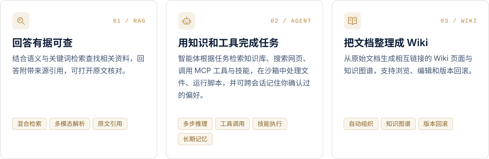
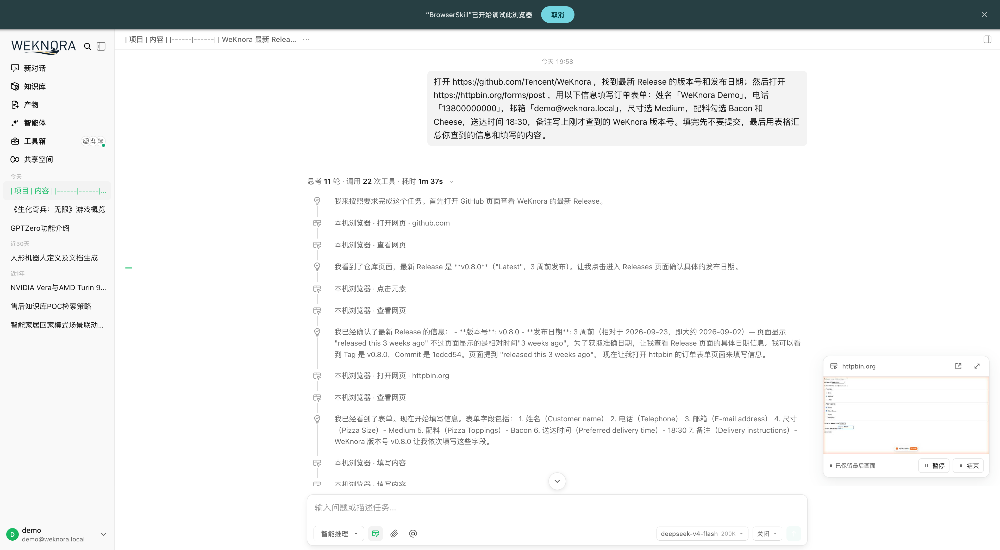
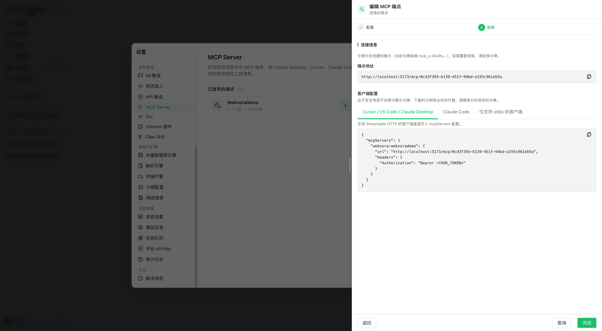
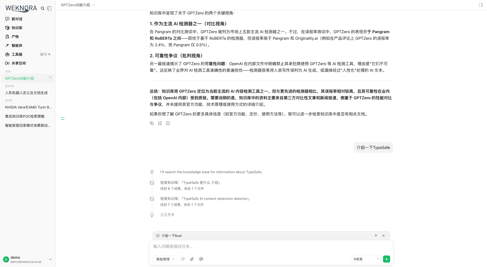
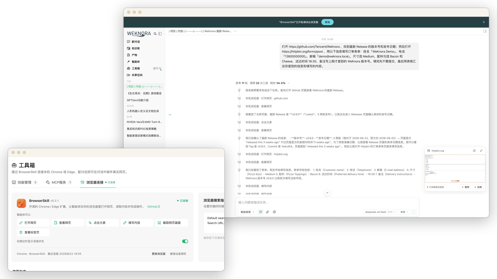
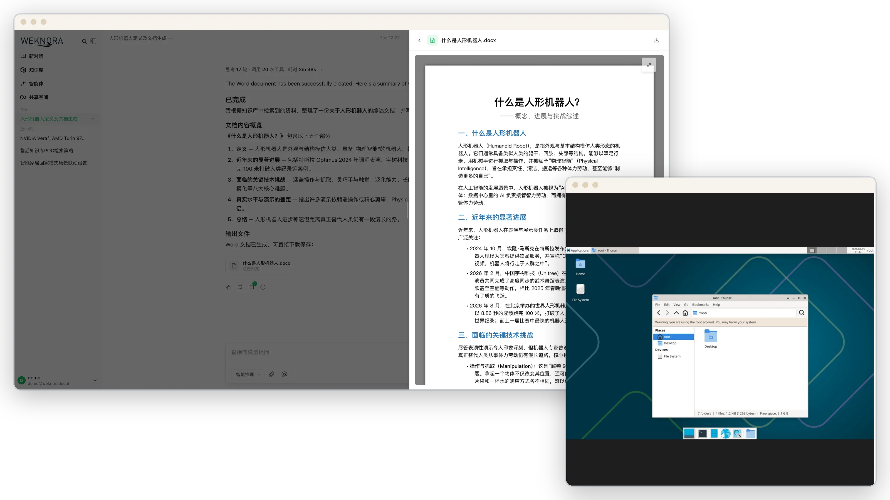
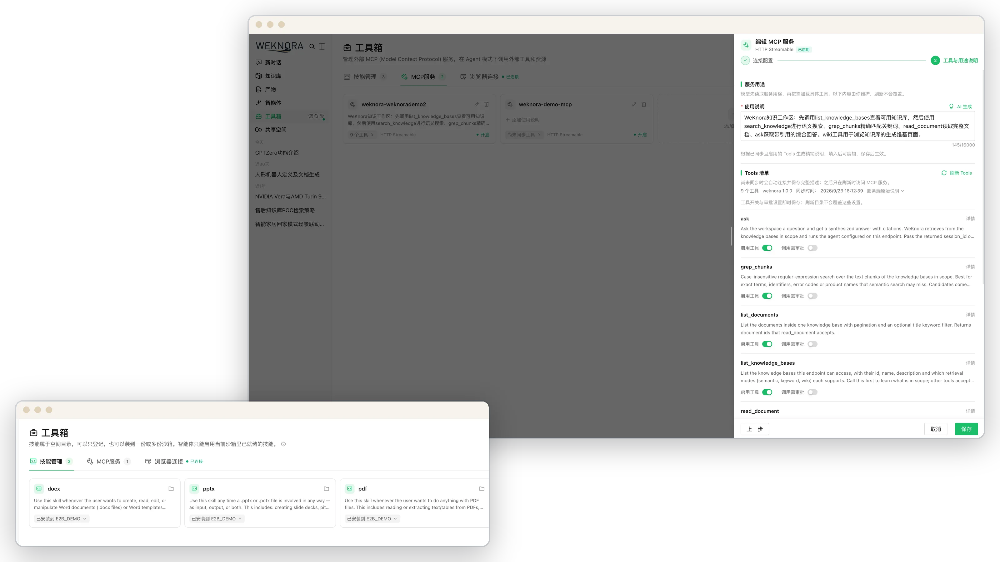
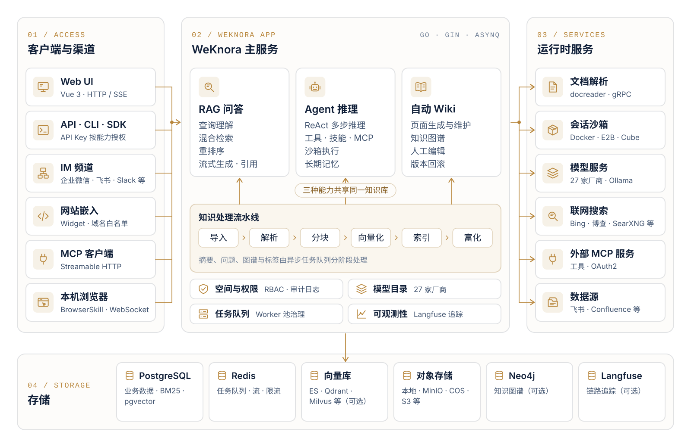

<p align="center">
  <a href="https://weknora.weixin.qq.com">
    <picture>
      <source media="(prefers-color-scheme: dark)" srcset="./docs/images/readme/hero-cn-dark.svg">
      
    </picture>
  </a>
</p>

<p align="center">
  <a href="https://weknora.weixin.qq.com"></a>
  <a href="https://weknora.weixin.qq.com/docs/"></a>
  <a href="./CHANGELOG.md"></a>
  <a href="./LICENSE"></a>
  <a href="https://github.com/Tencent/WeKnora/stargazers"></a>
  <br/>
  <a href="https://chatbot.weixin.qq.com"></a>
  <a href="https://chromewebstore.google.com/detail/jpemjbopikggjlmikmclgbmkhhopjdgd"></a>
  <a href="https://clawhub.ai/lyingbug/weknora"></a>
  <a href="https://www.npmjs.com/package/@wxg-prc-cpg/dsh-weknora"></a>
</p>

<p align="center">
  <a href="./README.md">English</a> · <b>简体中文</b> · <a href="./README_JA.md">日本語</a> · <a href="./README_KO.md">한국어</a>
</p>

<p align="center">
  <a href="#项目介绍">项目介绍</a> ·
  <a href="#快速开始">快速开始</a> ·
  <a href="#最新更新">最新更新</a> ·
  <a href="#功能概览">功能概览</a> ·
  <a href="#客户端与生态">客户端与生态</a> ·
  <a href="#文档">文档</a> ·
  <a href="#开发指南">开发指南</a>
</p>

<p align="center">
  <a href="https://trendshift.io/repositories/15289"></a>
</p>

## 项目介绍

**[WeKnora（维娜拉）](https://weknora.weixin.qq.com)** 是一款开源的、基于大语言模型（LLM）的知识管理框架，面向企业级文档理解、语义检索与智能推理场景。它把团队分散的文档汇集起来，用于检索、推理，并随资料更新持续维护。

https://github.com/user-attachments/assets/2819598d-3140-4623-814a-8162a22b653c

<p align="center"><sub>2 分 25 秒 · 1080p · 英文旁白，中英字幕</sub></p>

查询资料用 RAG，处理多步任务用 Agent，整理知识用 Wiki。三种能力共享同一知识库。

<picture>
  <source media="(prefers-color-scheme: dark)" srcset="./docs/images/readme/capabilities-cn-dark.svg">
  
</picture>

除此之外：

- **记忆与知识整理**：跨会话长期记忆保存用户确认过的个人信息、偏好与事实；文件夹上传保留原始目录结构；检索分块可以编辑、比对与回滚。
- **数据源与格式**：飞书知识库 / 飞书云盘 / Confluence / GitLab / 腾讯 IMA / Notion / 语雀 / 钉钉文档 / RSS 自动同步，更多数据源持续接入中；覆盖 PDF、Word、图片、Excel、XMind 等十余种格式，Office 文档由 anydoc 在 Go 进程内解析。
- **渠道与集成**：企业微信、飞书、Slack、Telegram 等 IM 频道内直接问答；网站嵌入 Widget 把智能体发布到外部站点；内置 MCP Server 供 Cursor、Claude 等 AI 工具连接；权限范围 API Key 与 Principal 模型用于程序化集成。
- **模型**：内置 27 家模型厂商与自动生成的模型目录，兼容 OpenAI、DeepSeek、Qwen（阿里云）、智谱、混元、Gemini、MiniMax、NVIDIA、LiteLLM、Ollama 等。
- **权限与运维**：多空间 RBAC（四级角色、资源归属、空间审计日志）、每空间多实例存储后端、运行时任务队列面板与 Worker 池治理，并通过 Langfuse 追踪 Agent 步骤、Token 用量与任务流水线。
- **部署**：大模型、向量数据库、存储后端均可替换，支持本地与私有云部署，数据留在你自己的环境中。

## 快速开始

<table>
  <tr>
    <td width="33%" valign="top">
      <br/>
      <sub>在线使用</sub><br/>
      <b>微信对话开放平台</b><br/>
      在线管理知识库，将问答服务接入公众号、小程序等微信场景。<br/><br/>
      <a href="https://chatbot.weixin.qq.com/login">进入平台 →</a>
    </td>
    <td width="33%" valign="top">
      <br/>
      <sub>云端部署</sub><br/>
      <b>腾讯云轻量应用服务器</b><br/>
      通过应用模板部署 WeKnora，在自己的云服务器上运行。<br/><br/>
      <a href="https://mc.tencent.com/s69nKCVz">前往腾讯云部署 →</a>
    </td>
    <td width="33%" valign="top">
      <br/>
      <sub>自行部署</sub><br/>
      <b>部署到自己的环境</b><br/>
      使用 Docker 或 Kubernetes 部署，自行配置模型、存储和网络。<br/><br/>
      <a href="#使用-docker-compose-部署">使用 Docker Compose 部署 ↓</a>
    </td>
  </tr>
</table>

### 使用 Docker Compose 部署

需要 [Docker](https://www.docker.com/)、[Docker Compose](https://docs.docker.com/compose/) 与 [Git](https://git-scm.com/)。

```bash
git clone https://github.com/Tencent/WeKnora.git
cd WeKnora
cp .env.example .env    # 按需编辑 .env，详见文件内注释
docker compose pull     # 拉取最新镜像
docker compose up -d    # 启动核心服务
```

启动成功后访问 **[http://localhost](http://localhost)**，按新手引导完成配置即可使用。带样例数据的完整上手流程见[快速上手](https://weknora.weixin.qq.com/docs/01-getting-started/03-quickstart)。

> [!TIP]
> 如需使用本地 Ollama 模型，请先运行 `ollama serve > /dev/null 2>&1 &`。Ollama 向量模型名、`OLLAMA_BASE_URL` 与内存说明见[配置文档](https://weknora.weixin.qq.com/docs/01-getting-started/04-configuration)。

| 服务 | 地址 |
|------|------|
| Web UI | `http://localhost` |
| 后端 API | `http://localhost:8080` |
| 链路追踪 (Langfuse) | `http://localhost:3000` |

### 可选服务

按需添加 `--profile` 启动额外组件，多个 profile 可叠加使用：

| Profile | 说明 |
|---------|------|
| _(默认)_ | 核心服务 |
| `full` | 全部功能 |
| `neo4j` | 知识图谱 (Neo4j) |
| `minio` | 对象存储 (MinIO) |
| `langfuse` | 链路追踪 (Langfuse) |

```bash
docker compose --profile neo4j --profile minio pull
docker compose --profile neo4j --profile minio up -d
docker compose down     # 停止服务
```

### 版本升级

若已有部署并下载了更新的 release：

```bash
# 在 .env 中将 WEKNORA_VERSION 设为目标版本（如 0.8.2），或保持 latest
docker compose pull     # 拉取与 WEKNORA_VERSION 匹配的镜像
docker compose up -d    # 用新镜像重建容器
```

> [!NOTE]
> 仅执行 `docker compose up -d` 会复用本地缓存镜像，可能导致 Web UI 显示版本与下载的 release 不一致。从 v0.8.0 升级前请先阅读[升级须知](https://weknora.weixin.qq.com/docs/07-releases/v0.8.2#upgrade-notes)。

### 其他部署方式

| 方式 | 适用场景 |
|------|----------|
| **Docker Compose** | 上面的标准部署，功能完整，多服务 |
| **Kubernetes (Helm)** | 生产集群；Chart 位于 [`helm/`](./helm) |
| **Lite 单二进制** | 本机或低资源环境，零外部依赖（SQLite + 内存队列）；与标准版的差异见 [Lite 与标准版区别](./docs/LITE.md) |
| **桌面应用** | 带图形界面的 Lite 运行时，免登录启动，macOS 上提供本机沙箱；尚未提供安装包，需自行构建 |

全部部署形态、硬件要求与常见拓扑见[安装部署](https://weknora.weixin.qq.com/docs/01-getting-started/02-installation)。

> [!WARNING]
> WeKnora 已提供登录鉴权，但在生产环境部署时，我们强烈建议：
> - 将 WeKnora 服务部署在内网 / 私有网络环境中，而非公网环境；
> - 避免将服务直接暴露在公网上，以防止重要信息泄露风险；
> - 为部署环境配置适当的防火墙规则和访问控制；
> - 定期更新到最新版本以获取安全补丁和改进。

## 最新更新

### v0.8.2 <sub>· 2026-09-24 · [版本说明](https://weknora.weixin.qq.com/docs/07-releases/v0.8.2)</sub>

智能体可以操作你电脑上的浏览器，知识库可以通过 MCP 接入其他 AI 工具，进行中的对话可以补充要求、分叉或回滚。

<table>
  <tr>
    <td width="33%" valign="top"><br/><b>操作你电脑上的浏览器</b></td>
    <td width="33%" valign="top"><br/><b>把知识库发布给其他 AI 工具</b></td>
    <td width="33%" valign="top"><br/><b>随时调整进行中的对话</b></td>
  </tr>
</table>

- **[本地浏览器（BrowserSkill）](https://weknora.weixin.qq.com/docs/07-releases/v0.8.2#local-browser)**：智能体通过开源 BrowserSkill 扩展操作用户自己的 Chrome / Edge，支持实时任务预览、暂停 / 继续，登录和验证码交给用户处理。
- **[内置 MCP Server](https://weknora.weixin.qq.com/docs/07-releases/v0.8.2#mcp-server)**：按空间发布 `/mcp/<endpoint_id>` 端点，Streamable HTTP，每个端点独立令牌、知识库范围、限流与工具分组；Python 版 `mcp-server/` 已弃用。
- **[对话控制](https://weknora.weixin.qq.com/docs/07-releases/v0.8.2#conversation-control)**：运行中追加要求、从任意历史问题分叉、原地回滚并还原沙箱检查点、按会话选择思考强度；生成的文件统一收在新增的产物库中。
- **[沙箱](https://weknora.weixin.qq.com/docs/07-releases/v0.8.2#sandbox)**：沙箱交互终端与图形桌面；macOS Lite 宿主机沙箱与项目文件夹；侧边栏工具箱集中管理技能、MCP 服务与浏览器连接。
- **[模型接入](https://weknora.weixin.qq.com/docs/07-releases/v0.8.2#models)**：重构的模型目录（27 家内置厂商，自动补全上下文窗口、最大输出、思考档位与视觉能力）；Agent 检索工具合并为 `search_knowledge` / `read_document` / `list_documents`。
- **[知识库与平台](https://weknora.weixin.qq.com/docs/07-releases/v0.8.2#knowledge)**：Confluence 与钉钉文档数据源；博查与 Serply 网络搜索；日语界面；IM 频道级回复语言；仅白名单出站模式。

> [!IMPORTANT]
> **不兼容变更：** 钉钉频道仅支持 Stream 模式，沙箱命令默认以 `root` 执行。详见[升级须知](https://weknora.weixin.qq.com/docs/07-releases/v0.8.2#upgrade-notes)。

### v0.8.0 <sub>· [版本说明](https://weknora.weixin.qq.com/docs/07-releases/v0.8.0)</sub>

- **技能沙箱运行时**：会话级常驻 Docker / E2B / Cube 后端，按空间配置网络策略；移除 Local 宿主机进程后端；Docker 需显式开启。
- **空间技能目录**：从 ClawHub / SkillHub / git / zip 安装，按沙箱快照、实时进度、文件浏览/编辑、个人与空间环境变量。
- **跨会话长期记忆**：profile / preference / fact / task / interest，自动抽取需确认，`search_memory`。
- **解析与数据源**：进程内 anydoc Office 解析；GitLab 与腾讯 IMA 数据源；XMind 解析。
- **生态**：官方 DeepSeek Harness 插件 `@wxg-prc-cpg/dsh-weknora`；LiteLLM；Exa 与 Metaso 网络搜索。
- **对话**：对话产物、问题大纲与时间戳；上下文压缩与供应商 Prompt Cache 标记。
- **安全**：OIDC JWKS 验签、可选复杂密码、文档自动打标签，以及大范围沙箱/安全加固。

<details>
<summary><b>更早版本（v0.2.0 – v0.7.2）</b></summary>

<br/>

- **v0.7.2** —— 上线**官方产品文档站**（VitePress，六大板块约 50 篇，覆盖约 360 个 API 端点与约 150 个环境变量，含独立 Docker/Nginx 部署、快速上手样例数据与本地 MCP demo）；**知识库文件夹树**（文件夹路径独立入库，可像文件管理器一样浏览、重命名与重新归档）；**分块编辑与版本历史**（可视化编辑检索分块、逐版本 diff 与回滚、自动重建索引、文档自定义元数据）；**Wiki 页面版本历史**（快照 + 行级 diff + 一键回滚 + 浏览器内手动编辑）；**API 文件直链模式** `resource_urls=public` / `RESOURCE_URL_MODE`（第三方 App 无需二次调用鉴权代理即可加载图片与文件）；**飞书云盘数据源**与 docx blocks 逐类型下钻同步；文档批量打标签；**MCP Server 1.1.x**（迁移到 mcp 2.x 高级 API，官方 PyPI 包 `tencent-weknora-mcp`，新增 `create_knowledge_from_text` 与 `list_shared_knowledge_bases`，共 29 个工具）；AWS S3 默认凭据链（IAM Role / IRSA）；本地 HTML 上传解析；QQBot Markdown 回复；新增 app / frontend / docreader / mcp-server 的 PR CI 检查。另有 router 与 modelcontext 大规模重构、重排与分块质量优化，以及大量稳定性修复。
- **v0.7.1** —— 新增**云之家 IM 集成**（WebSocket + 图片消息 + Markdown 回复）；**火山引擎 Rerank** 供应商（自动分批请求）与**智谱 AI 网络搜索**供应商；**平台级 API Key**，用于控制面自动化（空间管理、系统设置、运行时队列、审计日志）；**按知识库的活动审计追踪**；FAQ 管理增强（筛选、打标签、导出、导入结果追踪）；**Langfuse OTLP/OTel 追踪**迁移，支持 W3C traceparent 跨服务传播；对话头部操作栏，支持一键 **Markdown 导出**，并在引用抽屉中展示 Wiki 工具结果；Prompt 缓存可观测性；会话渠道治理（IM/嵌入/API 会话按管理员范围隔离）；飞书大型 Wiki 同步韧性增强；移除旧版 Neo4j 会话记忆依赖。另有大范围的 slug 完整性、SSRF 传输与状态同步加固。
- **v0.7.0** —— 细粒度**权限范围 API Key 与 Principal 模型**（能力级授权 + 按 KB 限制 + API 集成调试台）；**运行时任务队列可观测面板与 Worker 池治理**（分阶段独立池 + 按模型并发治理 + 失败任务排查/重试）；**多实例存储后端**（每空间多存储实例、按 KB 绑定、默认实例）；**会话级临时附件**（图片/文档异步解析 + 合并限额）；推荐问题与追问；稳定资源注册表与 LLM 上下文别名压缩；`@Skill / @MCP` 提及范围化 Agent 运行时；会话内 MCP OAuth 授权；QQBot 与 Lark（飞书国际版）IM 集成；Redis TLS；Requesty 模型厂商 + Keenable 网络搜索；无空间预置与受控自助创建工作区；管理员密码重置；知识库复制流程；`weknora` CLI v0.10。同时完成大范围安全加固（SSRF、密钥脱敏、SQL 校验、越权）。
- **v0.6.3** —— 网站嵌入 Widget 与发布集成中心（安全模式 Token 交换 + 限流）；对话体验全面革新（引用浮层、RAG 流水线进度、流式 Markdown）；文档多标签与批量重新解析；Wiki 文件夹与层级导航；RSS 数据源；MCP OAuth2；EPUB / MHTML 解析；Agent 模型就绪校验；模型调试器；会话来源筛选；工作区删除 UI。
- **v0.6.2** —— 按批次解析配置（`process_config`）+ 上传确认对话框；文档重新解析（reparse）支持覆盖配置；`weknora` CLI v0.9（内置 Agent Skills、`session stop`、auth/profile 统一）；知识库框选多选；pgvector 1024 维 HNSW 索引；对话资源 Store 重构；仅保留 Langfuse 追踪（移除 Jaeger）。
- **v0.6.1** —— 文档解析追踪时间线（Langfuse 风格 Span 树，逐阶段进度展示 + 解析中止）；OpenSearch 向量库驱动；YAML 声明式内置模型配置；系统管理员与统一平台设置 + 审计日志；新用户引导；设置页 UI 重构；`weknora` CLI v0.7 / v0.8（Agent 优先线协议、NDJSON、`--dry-run`）；OpenDataLoader 与 PaddleOCR-VL 解析引擎；MCP Server 多传输（stdio / SSE / HTTP）；按模型的思考模式配置；腾讯云 LKEAP 重排 + 原生 Gemini Embedding + MiniMax-M3。
- **v0.6.0** —— 空间 RBAC（四级角色矩阵 `Owner` / `Admin` / `Contributor` / `Viewer` + 按 KB 归属 + 每空间审计日志）、空间成员管理与多工作区 UX、自助创建工作区；`weknora` CLI v0.4 正式版 + `mcp serve`；KB 检索跨向量库扇出；MCP / 数据源凭据 AES-256-GCM 加密 + docreader gRPC TLS + Token；新增智谱 Embedding 与华为云 OBS；服务端用户偏好；Go 1.26.0。详见[多租户与认证](https://weknora.weixin.qq.com/docs/03-features/01-tenant-auth)。
- **v0.5.2** —— Wiki 入库支撑万级文档知识库（任务队列 + 死信队列）；MCP 工具人机审批；Anthropic / Apache Doris / 腾讯云 VectorDB / 金山云 KS3 / SearXNG 后端；自适应三层分块 + 实时调试面板；全局 ⌘K 命令面板；语雀连接器 + 微信小程序；`weknora` CLI 早期版本。
- **v0.5.1** —— 知识库批量管理；空间级 IM 频道总览；会话搜索 + 用户级置顶；模型 / 网页搜索 / MCP 统一卡片化设置；按 Agent LLM 调用超时；桌面端空间切换。
- **v0.5.0** —— Wiki 模式正式版 —— Agent 从原始文档自治生成结构化、相互链接的 Markdown Wiki 页面及知识图谱；Wiki 浏览器 + 可视化图谱。
- **v0.4.0** —— WeKnora Cloud（托管模型 + 解析）；Chrome 插件；ClawHub Skill；微信 IM；附件处理；Azure OpenAI / 阿里云 OSS；Notion 连接器；百度 + Ollama 网页搜索；VectorStore 管理。
- **v0.3.6** —— ASR 语音；飞书数据源自动同步；OIDC；IM 引用回复 + 线程会话；文档自动摘要；Tavily 搜索；并行工具调用；Agent @提及范围限制。
- **v0.3.5** —— Telegram / 钉钉 / Mattermost IM；IM 斜杠命令 + QA 队列；推荐问题；VLM 自动描述 MCP 返回图片；Novita AI；来源频道标记。
- **v0.3.4** —— 企业微信 / 飞书 / Slack IM；多模态图片；NVIDIA 模型 API；Weaviate；AWS S3；AES-256-GCM API Key 加密；内置 MCP 服务；混合检索优化；`final_answer` 工具。
- **v0.3.3** —— 父子分块；知识库置顶；兜底回复；Rerank 段落清洗；存储桶自动创建；Milvus。
- **v0.3.2** —— 知识搜索入口；按来源配置解析与存储引擎；本地存储图片渲染；文档预览；火山引擎 TOS；Mermaid 渲染；对话批量管理；记忆图谱预览。
- **v0.3.0** —— 共享空间；Agent Skills + 沙盒执行；自定义 Agent；数据分析 Agent；思考模式；Bing / Google 搜索；API Key 认证；Helm Chart；韩语 i18n；Qdrant。
- **v0.2.0** —— Agent 模式（ReACT）；多类型知识库（FAQ + 文档）；对话策略配置；DuckDuckGo 网页搜索；MCP 工具集成；全新 UI + Agent 模式切换；MQ 异步任务管理。

完整变更记录见 [`CHANGELOG.md`](./CHANGELOG.md)。

</details>

## 功能展示

### 快速问答与智能推理

**两种提问方式。** 快速问答基于知识库做 RAG 检索作答，并标注引用来源；智能推理由智能体规划多步任务，检索、阅读文档、调用工具与技能，每一步都在对话中展示。 [文档 →](https://weknora.weixin.qq.com/docs/03-features/18-chat-experience)

<a href="./docs/images/readme/spotlight-qa-light.webp">
<picture>
  <source media="(prefers-color-scheme: dark)" srcset="./docs/images/readme/spotlight-qa-dark.webp">
  
</picture>
</a>

### 本机浏览器

**操作你电脑上的浏览器。** 借助腾讯开源的 BrowserSkill 扩展，智能体直接在你的 Chrome 或 Edge 中打开网页、填写表单；遇到登录或验证码时交给你。 [文档 →](https://weknora.weixin.qq.com/docs/05-clients/09-local-browser)

<a href="./docs/images/readme/spotlight-browser-light.webp">
<picture>
  <source media="(prefers-color-scheme: dark)" srcset="./docs/images/readme/spotlight-browser-dark.webp">
  
</picture>
</a>

### 技能与沙箱

**运行技能，生成文件。** 支持 Docker、E2B、Cube。同一会话的多轮任务共用一个工作区，生成的文件可预览和下载；还可以在对话旁打开图形桌面或交互终端，查看智能体的每一步操作，必要时亲自接手。 [文档 →](https://weknora.weixin.qq.com/docs/03-features/22-skills-sandbox)

<a href="./docs/images/readme/spotlight-sandbox-light.webp">
<picture>
  <source media="(prefers-color-scheme: dark)" srcset="./docs/images/readme/spotlight-sandbox-dark.webp">
  
</picture>
</a>

### 工具箱：MCP 服务与技能

**智能体可用的工具。** 接入外部 MCP 服务，逐个选择启用哪些工具、哪些调用需要审批；从 ClawHub、SkillHub、Git 或 ZIP 安装技能，在空间内统一管理，供各个沙箱复用。 [文档 →](https://weknora.weixin.qq.com/docs/03-features/22-skills-sandbox)

<a href="./docs/images/readme/spotlight-toolbox-light.webp">
<picture>
  <source media="(prefers-color-scheme: dark)" srcset="./docs/images/readme/spotlight-toolbox-dark.webp">
  
</picture>
</a>

### 自动 Wiki

**把文档整理成可浏览的 Wiki。** 开启 Wiki 后，从知识库文档中提取人物、产品和概念，生成带来源引用的页面，按目录浏览；在知识图谱中查看页面之间的关系，页面可直接编辑，改动可回溯。 [文档 →](https://weknora.weixin.qq.com/docs/03-features/14-wiki)

<a href="./docs/images/readme/spotlight-wiki-light.webp">
<picture>
  <source media="(prefers-color-scheme: dark)" srcset="./docs/images/readme/spotlight-wiki-dark.webp">
  
</picture>
</a>

### 可观测性

**追踪与运行监控。** Langfuse 追踪智能体每一步的推理、工具调用与 Token 用量；文档解析时间线逐阶段展示进度；任务队列面板列出排队与失败的任务。 [文档 →](https://weknora.weixin.qq.com/docs/03-features/16-observability)

<a href="./docs/images/readme/spotlight-observability-light.webp">
<picture>
  <source media="(prefers-color-scheme: dark)" srcset="./docs/images/readme/spotlight-observability-dark.webp">
  
</picture>
</a>

## 架构设计

<a href="./docs/images/readme/architecture-cn-light.svg">
<picture>
  <source media="(prefers-color-scheme: dark)" srcset="./docs/images/readme/architecture-cn-dark.svg">
  
</picture>
</a>

从文档解析、向量化、检索到大模型推理，各环节模块化解耦，组件可替换、可扩展。支持本地与私有云部署，Web UI 开箱即用。延伸阅读：[架构总览](https://weknora.weixin.qq.com/docs/02-architecture/01-overview) · [RAG 流水线](https://weknora.weixin.qq.com/docs/02-architecture/04-rag-pipeline) · [扩展点](https://weknora.weixin.qq.com/docs/06-development/03-extension-points)。

## 功能概览

### 智能对话

<sub>文档：[Agent](https://weknora.weixin.qq.com/docs/03-features/07-agent) · [Wiki](https://weknora.weixin.qq.com/docs/03-features/14-wiki) · [技能与沙箱](https://weknora.weixin.qq.com/docs/03-features/22-skills-sandbox) · [长期记忆](https://weknora.weixin.qq.com/docs/03-features/23-memory) · [对话体验](https://weknora.weixin.qq.com/docs/03-features/18-chat-experience)</sub>

| 能力 | 详情 |
|------|------|
| 智能推理 | ReACT 渐进式多步推理，自主编排知识检索、MCP 工具、技能沙箱、本地浏览器与网络搜索 |
| 快速问答 | 基于知识库的 RAG 问答，快速准确地回答问题 |
| Wiki 模式 | Agent 驱动从原始文档中自动生成并维护结构化、相互链接的 Markdown Wiki 知识页面；支持浏览器内人工编辑、页面版本历史、行级 diff 与一键回滚 |
| 技能目录与沙箱 | 空间技能目录（ClawHub / SkillHub / git / zip）安装到会话级 Docker / E2B / Cube 沙箱 · `shell_exec`、文件工具、产物收集、按配置网络策略 · 对话旁提供交互终端与浏览器内图形桌面 · macOS 桌面版把未固定沙箱的会话放在系统沙箱（Seatbelt）中运行，可绑定所选项目文件夹或使用按日期创建的临时工作区 · 已移除 Local 宿主机进程后端 |
| 本地浏览器 | 智能体通过开源 BrowserSkill 扩展在独立任务窗口中操作用户自己的 Chrome / Edge（打开页面、点击、填表、读取内容），支持实时预览、暂停 / 继续 / 结束，登录与验证码交由用户处理 |
| 对话控制 | 运行中追加要求、从任意历史问题分叉对话、原地回滚（沙箱工作区同步还原到对应检查点），按会话选择思考强度 |
| 产物库 | 侧边栏集中列出所有对话生成的文件，支持类型筛选、搜索、按日期分组与版本历史 |
| 长期记忆 | 跨会话记忆（profile / preference / fact / task / interest），支持自动抽取、用户确认与按需 `search_memory` |
| 工具调用 | 内置工具、MCP 工具（含 OAuth2 远程服务、会话内 OAuth 授权）、网络搜索 · 支持 `@Skill / @MCP` 提及以按轮次范围化 Agent 运行时 · MCP 工具按需发现与调用，可逐个启用或停用 |
| 对话策略 | 在线 Prompt 编辑、检索阈值调节、多轮上下文感知、按 Agent 引用输出开关 |
| 推荐问题 | 基于知识库内容自动生成推荐问题与答后追问 |
| 临时附件 | 会话级临时上传图片 / 文档，异步解析后用于一次性问答，支持图片与附件合并限额 |
| 引用与 RAG 进度 | 对话内引用浮层与引用抽屉（区分网络 / 知识库来源）、统一 Markdown 渲染、RAG 流水线分阶段进度展示 |
| 会话管理 | 侧边栏按来源（Web / IM / 嵌入）筛选与分组会话，支持会话标题内联重命名 |

### 知识管理

<sub>文档：[知识库](https://weknora.weixin.qq.com/docs/03-features/02-knowledge-base) · [文档解析](https://weknora.weixin.qq.com/docs/03-features/03-document-parsing) · [分块](https://weknora.weixin.qq.com/docs/03-features/04-chunking) · [检索引擎](https://weknora.weixin.qq.com/docs/03-features/05-retrieval-engines) · [知识图谱](https://weknora.weixin.qq.com/docs/03-features/09-knowledge-graph) · [数据源](https://weknora.weixin.qq.com/docs/03-features/10-datasource)</sub>

| 能力 | 详情 |
|------|------|
| 知识库类型 | FAQ / 文档 / Wiki，支持文件夹导入、URL 导入、多标签管理、在线录入 |
| 文件夹树 | 文件夹上传保留原始目录结构，侧栏树形浏览、重命名文件夹、把文档重新归档到其他文件夹 |
| 分块编辑与版本历史 | 在界面直接编辑检索分块，保留逐版本快照，支持 diff 与一键回滚，编辑后自动重建索引 · 生成问题可增删改与重新生成 · 支持文档自定义元数据 |
| 按批次解析配置 | 上传确认对话框或 `process_config` API 覆盖解析引擎、分块、多模态（VLM / ASR）、图谱抽取与问题生成；支持 reparse 时调整配置 |
| 批量重新解析 | 一次为多篇文档重新排队解析，可携带批次级 `process_config` |
| 数据源导入 | 飞书知识库 / 飞书云盘 / Lark / Confluence / GitLab / 腾讯 IMA / Notion / 语雀 / 钉钉文档 / RSS 订阅自动同步（更多数据源开发中），支持增量与全量同步 |
| 文档格式 | PDF / Word / Txt / Markdown / HTML / EPUB / MHTML / 图片 / CSV / Excel / PPT / JSON / XMind |
| 自动打标签 | 解析完成后从知识库已有标签中选择匹配项增量关联，不创建新标签、不覆盖人工标签 |
| 检索策略 | BM25 稀疏召回 / Dense 稠密召回 / GraphRAG 图谱增强 / 父子分块 / pgvector HNSW 加速（1024 维）/ 多维度索引 |
| 文档知识图谱 | 将文档转化为知识图谱，展示不同段落之间的关联关系，为索引和检索提供结构化支撑，提升检索结果的相关性和广度（需部署 Neo4j：启用 `neo4j` profile 并设置 `NEO4J_ENABLE=true`） |
| 批量选择与打标签 | 知识库文档列表支持框选（marquee）多选，可批量重新解析、批量打标签（自动预选公共标签） |
| 端到端测试 | 检索+生成全链路可视化，评估召回命中率、BLEU / ROUGE 等指标 |

### 集成与扩展

<sub>文档：[模型](https://weknora.weixin.qq.com/docs/03-features/06-models) · [MCP](https://weknora.weixin.qq.com/docs/03-features/08-mcp) · [网络搜索](https://weknora.weixin.qq.com/docs/03-features/11-web-search) · [IM 集成](https://weknora.weixin.qq.com/docs/03-features/12-im-integration) · [网站嵌入](https://weknora.weixin.qq.com/docs/03-features/13-embed-channel) · [存储后端](https://weknora.weixin.qq.com/docs/03-features/19-storage-backends)</sub>

| 能力 | 详情 |
|------|------|
| 模型厂商 | OpenAI / Azure OpenAI / Anthropic（Claude）/ DeepSeek / Qwen（阿里云）/ 智谱 / 混元 / 豆包（火山引擎）/ Gemini / MiniMax / NVIDIA / Novita AI / SiliconFlow / OpenRouter / Requesty / LiteLLM / Ollama |
| 向量数据库 | PostgreSQL (pgvector) / Elasticsearch / OpenSearch / Milvus / Weaviate / Qdrant / Apache Doris / 腾讯云 VectorDB |
| Embedding | Ollama / BGE / GTE / 智谱 / OpenAI 兼容接口 |
| 对象存储 | 本地 / 腾讯云 COS / 火山引擎 TOS / MinIO / AWS S3（支持 IAM Role / IRSA 默认凭据链）/ 阿里云 OSS / 金山云 KS3 / 华为云 OBS · 支持**每空间多实例存储后端**，不同知识库可绑定不同实例并设置默认实例 |
| IM 集成 | 企业微信 / 飞书 / Lark（飞书国际版）/ QQBot / Slack / Telegram / 钉钉 / Mattermost / 微信 / 云之家 |
| 网站嵌入 | 通过嵌入 Widget 发布智能体，支持域名白名单、限流与安全模式 Token 交换 |
| 网络搜索 | DuckDuckGo / Bing / Google / Tavily / Baidu / Ollama / SearXNG / Keenable / 智谱 AI / Exa / Metaso / 博查 / Serply |
| API 集成 | 权限范围 API Key（能力级授权 + 按 KB 限制 + 节流的 last_used 追踪）与 API 集成调试台 · MCP OAuth 与嵌入会话按 Principal 隔离 · `resource_urls=public` 直接返回可加载的文件/图片直链，免去二次鉴权代理调用 |
| MCP Server | 内置：按空间发布 `/mcp/<endpoint_id>` 端点（Streamable HTTP），每个端点独立令牌、知识库范围、限流与工具分组（检索、`ask`、Wiki、需手动开启的写入工具）；Python 包 `tencent-weknora-mcp` 已弃用 |

### 平台能力

<sub>文档：[多租户与认证](https://weknora.weixin.qq.com/docs/03-features/01-tenant-auth) · [可观测性](https://weknora.weixin.qq.com/docs/03-features/16-observability) · [平台管理](https://weknora.weixin.qq.com/docs/03-features/20-platform-admin) · [异步任务](https://weknora.weixin.qq.com/docs/02-architecture/05-async-tasks)</sub>

| 能力 | 详情 |
|------|------|
| 部署 | 本地 / Docker / Kubernetes (Helm)，支持私有化离线部署 |
| 界面 | Web UI / RESTful API / 命令行（`weknora`）/ Chrome Extension / 网站嵌入 Widget / 微信小程序 · 界面支持中文 / 英文 / 日文 / 韩文 / 俄文 |
| 权限控制 | 空间 RBAC 四级角色矩阵（Owner / Admin / Contributor / Viewer），按知识库的资源归属，每空间审计日志，invite-only 准入，无空间预置与受控自助创建工作区，管理员密码重置（会话吊销），跨空间超级管理员，权限范围 API Key |
| 安全 | API Key 与 MCP / 数据源凭据 AES-256-GCM 静态加密、支持平滑密钥轮换 · app ↔ docreader gRPC TLS + Token · Redis TLS · 防 SSRF HTTP 客户端（覆盖数据源、URL 导入、重定向链等）· 密钥响应脱敏 · 技能沙箱隔离（Docker 需开启 / E2B / Cube）与按配置网络策略 · OIDC ID Token JWKS 验签 · 可选复杂密码策略 · 仅白名单出站模式（`SSRF_DNS_WHITELIST_ONLY`） |
| 可观测性 | 集成 Langfuse（唯一追踪后端）以追踪 ReAct 循环、Token 消耗、工具调用和任务流水线 · 内置 Langfuse 风格的文档解析追踪时间线，逐阶段展示解析进度 · 系统管理员运行时任务队列面板（队列深度、按模型并发、失败任务排查与手动重试） |
| 任务管理 | MQ 异步任务，分阶段独立 Worker 池治理（core / 后处理 / enrichment / maintenance + 弹性共享池，Wiki 独立池）与按模型后台并发治理 · 版本升级自动数据库迁移 |
| 模型管理 | 集中配置，YAML 声明式内置模型配置，知识库级别模型选择，按模型思考模式与 Embedding 维度覆盖，交互式模型调试器，多空间共享内置模型，WeKnora Cloud 托管模型与文档解析 · 模型目录自动补全上下文窗口、最大输出、思考档位与视觉能力，提供实际调用预览与按模型协议覆盖 |

## 客户端与生态

| | 客户端 | 用途 |
|:-:|--------|------|
|  | [**命令行 `weknora`**](./cli/README.md) | Agent 优先的命令行，覆盖完整 API，附带精选 MCP 工具面与内置 Agent Skills |
|  | [**内置 MCP Server**](https://weknora.weixin.qq.com/docs/03-features/08-mcp) | 把知识库开放给 Cursor、Claude 等 MCP 客户端 |
|  | [**本地浏览器（BrowserSkill）**](https://weknora.weixin.qq.com/docs/05-clients/09-local-browser) | 让智能体操作用户自己的 Chrome / Edge |
|  | [**Chrome 插件**](https://chromewebstore.google.com/detail/jpemjbopikggjlmikmclgbmkhhopjdgd) | 在浏览器中选中文本、图片或整个页面，一键保存为知识条目，无需复制粘贴或手动上传文件 |
|  | [**微信小程序**](./miniprogram/README.md) | 轻量移动端：配置 WeKnora API、选择知识库、导入 URL，并在微信内向知识库提问 |
|  | [**ClawHub Skill**](https://clawhub.ai/lyingbug/weknora) | 发布在 ClawHub 上的 WeKnora 技能，通过 REST API 导入文档、混合检索与管理知识条目 |
|  | [**DeepSeek Harness 插件**](https://www.npmjs.com/package/@wxg-prc-cpg/dsh-weknora) | 让 `dsh` 编码 Agent 只读访问你的文档 |
|  | [**网站嵌入 Widget**](https://weknora.weixin.qq.com/docs/03-features/13-embed-channel) | 将智能体发布到外部站点 |
|  | [**Go SDK**](https://weknora.weixin.qq.com/docs/05-clients/03-go-sdk) | 知识库、文档、会话等资源的 CRUD 与 SSE 流式问答 |
|  | [**微信对话开放平台**](https://chatbot.weixin.qq.com) | 基于 WeKnora 的托管问答平台，上传知识即可在微信内发布问答服务，无需写代码 |

### 命令行工具

`weknora` 是官方命令行工具，可在终端或 AI Agent 中驱动 API。它**以 Agent 为先**：每条命令默认输出稳定的 JSON 信封（带类型化错误码并映射到退出码），`--format text` 则面向人类阅读。它还提供精选的 MCP 工具面（`weknora mcp serve`），并内置 Agent Skills。

```bash
weknora profile add prod --host https://kb.example.com --use
weknora auth login
weknora kb list
weknora link --kb my-knowledge-base    # 绑定当前目录
weknora doc upload notes.md
weknora chat "总结一下设计文档"
```

在无界面 / CI 场景下，设置 `WEKNORA_API_KEY` 与 `WEKNORA_HOST` 即可跳过 `auth login`，不会有凭据写入磁盘。安装与 5 分钟上手见 [`cli/README.md`](./cli/README.md)，AI Agent 依赖的操作约定见 [`cli/AGENTS.md`](./cli/AGENTS.md)。

### MCP Server

WeKnora 已内置 MCP Server：在「**设置 → 发布集成 → MCP Server**」新建端点，客户端通过 Streamable HTTP 连接 `/mcp/<endpoint_id>` 即可，详见 [MCP 文档](https://weknora.weixin.qq.com/docs/03-features/08-mcp)。[`mcp-server/`](./mcp-server/MCP_CONFIG.md) 下的独立 Python 服务已弃用，仅为兼容旧部署保留。

<details>
<summary><b>ClawHub Skill</b></summary>

<br/>

[**WeKnora ClawHub Skill**](https://clawhub.ai/lyingbug/weknora) 是 WeKnora 发布在 ClawHub 平台上的技能。安装后，可通过 WeKnora REST API 上传文档（文件 / URL / Markdown）、执行混合检索（向量 + 关键词）以及管理知识条目。

- **文档导入**：通过 Agent 上传文件、导入网页或写入 Markdown 知识
- **混合检索**：在单个或多个知识库中进行向量 + 关键词混合搜索
- **知识管理**：以编程方式浏览、编辑和删除知识条目

</details>

<details>
<summary><b>DeepSeek Harness 插件</b></summary>

<br/>

[**`@wxg-prc-cpg/dsh-weknora`**](https://www.npmjs.com/package/@wxg-prc-cpg/dsh-weknora) 是官方的 [DeepSeek Harness](https://github.com/deepseek-ai/deepseek-harness)（`dsh`）插件（[说明](./packages/dsh-weknora/README_CN.md)）。harness 自身不带任何检索、向量或知识库能力，这个插件把你的文档接进编码 Agent：`dsh plugin --profile web add @wxg-prc-cpg/dsh-weknora`，指向一个部署，Agent 的工具集里就会出现四个只读工具。

- **`weknora_search`**：混合检索，返回原文片段，每条都带可复用的 `knowledge_id`
- **`weknora_read_document`**：把单个文档的分块按序拼回正文，支持翻页
- **`weknora_ask`**：WeKnora 自己带引用的成稿答案，走 RAG 或 ReAct 流水线
- **`weknora_list_knowledge_bases`**：知识库名称与 id，便于 Agent 自己缩小检索范围

</details>

<details>
<summary><b>微信对话开放平台</b></summary>

<br/>

[微信对话开放平台](https://chatbot.weixin.qq.com)以 WeKnora 为核心技术框架，以托管服务的形式提供：

- **零代码部署**：上传知识即可在微信生态中发布问答服务。
- **问题管理**：高频问题按类别独立管理，配套数据工具，便于保持回答准确、易于维护。
- **微信场景接入**：问答能力可接入公众号、小程序等微信场景。

</details>

## 文档

完整产品文档见 **[weknora.weixin.qq.com/docs](https://weknora.weixin.qq.com/docs/)**，按「入门 → 架构 → 功能 → API → 客户端 → 开发」六个板块组织，覆盖约 360 个 API 端点、约 150 个环境变量与 9 大扩展点。

| 从这里开始 | |
|------------|---|
| [产品介绍](https://weknora.weixin.qq.com/docs/01-getting-started/01-introduction) | 能力总览 |
| [安装部署](https://weknora.weixin.qq.com/docs/01-getting-started/02-installation) | Docker Compose、Helm、Lite 与桌面端 |
| [配置说明](https://weknora.weixin.qq.com/docs/01-getting-started/04-configuration) | 环境变量与模型配置 |
| [常见问题排查](https://weknora.weixin.qq.com/docs/01-getting-started/05-troubleshooting) | 常见问题与解决办法 |
| [API 文档](https://weknora.weixin.qq.com/docs/04-api/01-api-overview) | REST API 总览 |
| [版本说明](https://weknora.weixin.qq.com/docs/07-releases/v0.8.2) | 各版本变更详解 |

## 开发指南

频繁修改代码时不需要每次重新构建 Docker 镜像，使用快速开发模式即可：

```bash
make dev-start      # 启动基础设施
make dev-app        # 启动后端（新终端）
make dev-frontend   # 启动前端（新终端）
```

- 前端修改自动热重载（无需重启）
- 后端修改快速重启（5-10 秒，支持 Air 热重载）
- 无需重新构建 Docker 镜像
- 支持 IDE 断点调试

详细说明见[开发环境快速入门](https://weknora.weixin.qq.com/docs/06-development/01-dev-guide)。

文档站与产品主页的源码位于 [`website-docs/`](./website-docs/README.md)。使用 Node.js 24 运行 `cd website-docs && npm run setup && npm run build && npm run preview` 即可同时预览两者；统一的静态产物在 `/` 提供主页、在 `/docs/` 提供文档。Nginx 与 Docker 部署方式见该目录的 README。

## 贡献指南

欢迎通过 [Issue](https://github.com/Tencent/WeKnora/issues) 反馈问题或提交 Pull Request。

- **流程：** Fork → 新建分支 → 提交更改 → 创建 PR
- **规范：** 使用 `gofmt` 格式化代码，遵循 [Conventional Commits](https://www.conventionalcommits.org/) 提交（`feat:` / `fix:` / `docs:` / `test:` / `refactor:`）

<details>
<summary><b>验证方式</b></summary>

<br/>

对于范围集中的 PR，优先验证本次改动涉及的文件和包：

```bash
git fetch origin main
git diff --check origin/main...HEAD
golangci-lint run --new-from-rev=origin/main ./...
go test ./path/to/changed/package -count=1
```

提交前请对改动过的 Go 文件运行 `gofmt`。对于前端改动，请在 `frontend/` 目录运行相关测试；如果改动涉及 TypeScript 或 Vue 组件，还应运行 `npm run type-check`。

维护者使用的全仓验证命令仍然是：

```bash
make fmt
make lint
make test
```

`make fmt` 会格式化整个 Go 仓库，因此请仅在工作区干净时运行，并检查产生的 diff。部分全量测试依赖本地基础设施或服务配置。如果全仓检查因无关的基线问题或环境依赖失败，请在 PR 中写明具体命令和错误，同时提供本次改动范围内通过的定向测试。

</details>

### 贡献者

感谢所有贡献者：

[](https://github.com/Tencent/WeKnora/graphs/contributors)

## 许可证

本项目基于 [MIT](./LICENSE) 协议发布。你可以自由使用、修改和分发本项目代码，但需保留原始版权声明。
