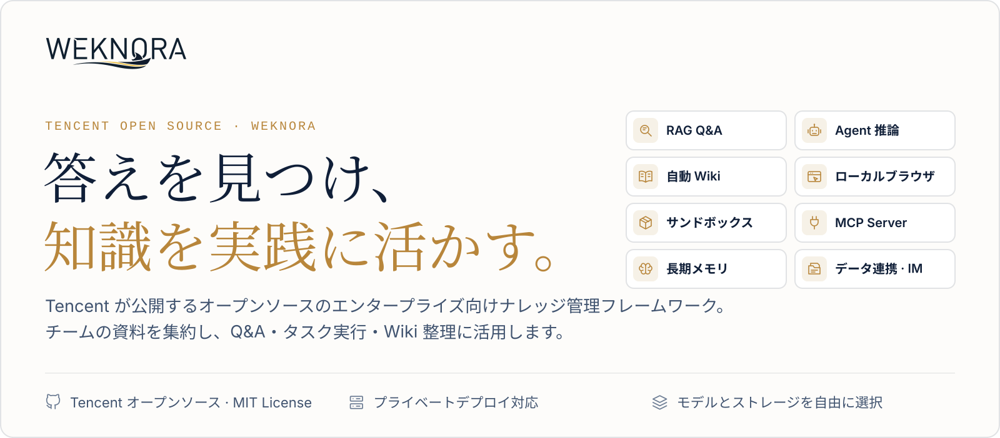
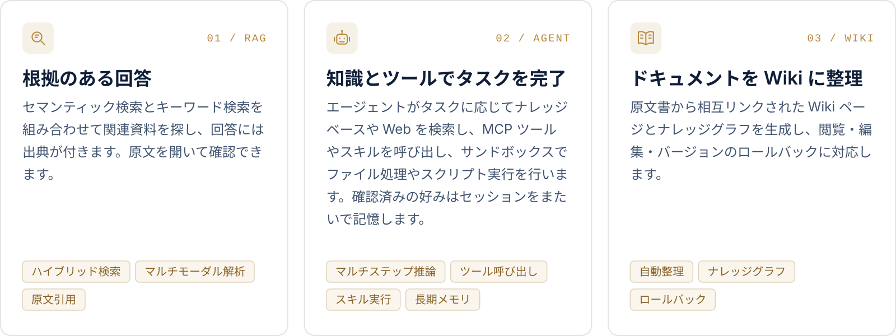
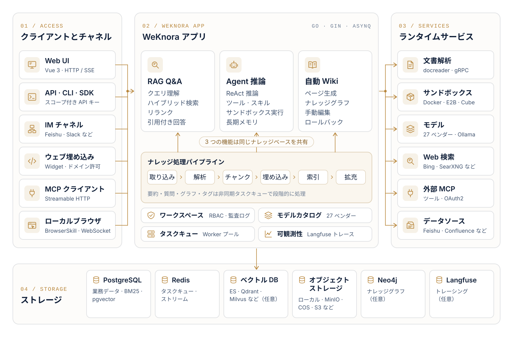

<p align="center">
  <a href="https://weknora.weixin.qq.com">
    <picture>
      <source media="(prefers-color-scheme: dark)" srcset="./docs/images/readme/hero-ja-dark.svg">
      
    </picture>
  </a>
</p>

<p align="center">
  <a href="https://weknora.weixin.qq.com"></a>
  <a href="https://weknora.weixin.qq.com/docs/"></a>
  <a href="./CHANGELOG.md"></a>
  <a href="./LICENSE"></a>
  <a href="https://github.com/Tencent/WeKnora/stargazers"></a>
  <br/>
  <a href="https://chatbot.weixin.qq.com"></a>
  <a href="https://chromewebstore.google.com/detail/jpemjbopikggjlmikmclgbmkhhopjdgd"></a>
  <a href="https://clawhub.ai/lyingbug/weknora"></a>
  <a href="https://www.npmjs.com/package/@wxg-prc-cpg/dsh-weknora"></a>
</p>

<p align="center">
  <a href="./README.md">English</a> · <a href="./README_CN.md">简体中文</a> · <b>日本語</b> · <a href="./README_KO.md">한국어</a>
</p>

<p align="center">
  <a href="#プロジェクト紹介">プロジェクト紹介</a> ·
  <a href="#クイックスタート">クイックスタート</a> ·
  <a href="#最新アップデート">最新アップデート</a> ·
  <a href="#機能概要">機能概要</a> ·
  <a href="#クライアントとエコシステム">クライアント</a> ·
  <a href="#ドキュメント">ドキュメント</a> ·
  <a href="#開発ガイド">開発ガイド</a>
</p>

<p align="center">
  <a href="https://trendshift.io/repositories/15289"></a>
</p>

## プロジェクト紹介

**[WeKnora（ウィーノラ）](https://weknora.weixin.qq.com)** は、大規模言語モデル（LLM）をベースとしたオープンソースのナレッジフレームワークで、エンタープライズ向けの文書理解、セマンティック検索、推論に対応します。チームに散在する文書を集約し、検索・推論に使えるようにし、資料の更新に合わせて維持します。

https://github.com/user-attachments/assets/19b28ce2-a62f-4f54-b289-c983576259bc

<p align="center"><sub>2 分 25 秒 · 1080p · 英語ナレーション・英語字幕</sub></p>

資料の検索には RAG、マルチステップのタスクには Agent、ナレッジの整理には Wiki。3 つの機能は同じナレッジベースを共有します。

<picture>
  <source media="(prefers-color-scheme: dark)" srcset="./docs/images/readme/capabilities-ja-dark.svg">
  
</picture>

そのほか：

- **メモリとナレッジ整理**：クロスセッション長期メモリが、ユーザーが確認したプロフィール・好み・事実を保持します。フォルダーアップロードは元のディレクトリ構造を保ち、検索チャンクは編集・差分比較・ロールバックできます。
- **データソースとフォーマット**：Feishu ナレッジベース / Feishu クラウドドライブ / Confluence / GitLab / Tencent IMA / Notion / Yuque / DingTalk Docs / RSS の自動同期（順次拡充中）。PDF、Word、画像、Excel、XMind など 10 以上のフォーマットに対応し、Office 文書は anydoc でプロセス内解析します。
- **チャネルと連携**：WeChat Work、Feishu、Slack、Telegram などの IM で直接 Q&A、ウェブサイト埋め込み Widget で外部サイトにエージェントを公開、組み込み MCP Server で Cursor や Claude などの AI ツールと接続、スコープ付き API キーと Principal モデルでプログラム連携。
- **モデル**：27 の組み込みベンダーと自動生成のモデルカタログ。OpenAI、DeepSeek、Qwen（Alibaba Cloud）、Zhipu、Hunyuan、Gemini、MiniMax、NVIDIA、LiteLLM、Ollama などに対応。
- **権限と運用**：マルチワークスペース RBAC（4 階層ロール、リソース所有権、ワークスペース監査ログ）、ワークスペースごとの複数ストレージインスタンス、ランタイムタスクキューダッシュボードと Worker プール統治、Langfuse による Agent ステップ・トークン消費・パイプラインのトレーシング。
- **デプロイ**：LLM、ベクトルデータベース、ストレージバックエンドはすべて差し替え可能。ローカルまたはプライベートクラウドにデプロイし、データを自社環境に置けます。

## クイックスタート

<table>
  <tr>
    <td width="33%" valign="top">
      <br/>
      <sub>オンライン</sub><br/>
      <b>WeChat 対話オープンプラットフォーム</b><br/>
      ナレッジベースをオンラインで管理し、Q&A を公式アカウントやミニプログラムなどの WeChat シナリオに接続します。<br/><br/>
      <a href="https://chatbot.weixin.qq.com/login">プラットフォームを開く →</a>
    </td>
    <td width="33%" valign="top">
      <br/>
      <sub>クラウド</sub><br/>
      <b>Tencent Cloud Lighthouse</b><br/>
      アプリケーションテンプレートから WeKnora をデプロイし、自分のクラウドサーバーで運用します。<br/><br/>
      <a href="https://mc.tencent.com/s69nKCVz">Tencent Cloud でデプロイ →</a>
    </td>
    <td width="33%" valign="top">
      <br/>
      <sub>セルフホスト</sub><br/>
      <b>自分の環境にデプロイ</b><br/>
      Docker または Kubernetes でデプロイし、モデル・ストレージ・ネットワークを自分で設定します。<br/><br/>
      <a href="#docker-compose-でデプロイ">Docker Compose でデプロイ ↓</a>
    </td>
  </tr>
</table>

### Docker Compose でデプロイ

[Docker](https://www.docker.com/)、[Docker Compose](https://docs.docker.com/compose/)、[Git](https://git-scm.com/) が必要です。

```bash
git clone https://github.com/Tencent/WeKnora.git
cd WeKnora
cp .env.example .env    # 必要に応じて .env を編集（詳細はファイル内のコメント参照）
docker compose pull     # 最新イメージを取得
docker compose up -d    # コアサービスを起動
```

起動後、**[http://localhost](http://localhost)** にアクセスし、オンボーディングガイドに沿って設定してください。サンプルデータ付きの手順は[クイックスタート](https://weknora.weixin.qq.com/docs/01-getting-started/03-quickstart)（中国語）を参照してください。

> [!TIP]
> ローカル Ollama モデルを使用する場合は、先に `ollama serve > /dev/null 2>&1 &` を実行してください。Ollama の埋め込みモデル名、`OLLAMA_BASE_URL`、メモリの注意は[設定ドキュメント](https://weknora.weixin.qq.com/docs/01-getting-started/04-configuration)を参照してください。

| サービス | URL |
|---------|-----|
| Web UI | `http://localhost` |
| バックエンド API | `http://localhost:8080` |
| Langfuse トレーシング | `http://localhost:3000` |

### オプションサービス

`--profile` フラグで追加コンポーネントを有効化します。複数の profile を組み合わせ可能です。

| Profile | 説明 |
|---------|------|
| _(デフォルト)_ | コアサービス |
| `full` | 全機能 |
| `neo4j` | ナレッジグラフ (Neo4j) |
| `minio` | オブジェクトストレージ (MinIO) |
| `langfuse` | トレーシング (Langfuse) |

```bash
docker compose --profile neo4j --profile minio pull
docker compose --profile neo4j --profile minio up -d
docker compose down     # サービスを停止
```

### アップグレード

既存のデプロイがあり、新しい release をダウンロードした場合：

```bash
# .env の WEKNORA_VERSION を対象バージョン（例: 0.8.2）に設定、または latest のまま
docker compose pull     # WEKNORA_VERSION に一致するイメージを取得
docker compose up -d    # 新しいイメージでコンテナを再作成
```

> [!NOTE]
> `docker compose up -d` のみではローカルキャッシュのイメージが再利用され、Web UI の表示バージョンがダウンロードした release と一致しない場合があります。v0.8.0 からアップグレードする前に[アップグレードの注意事項](https://weknora.weixin.qq.com/docs/07-releases/v0.8.2#upgrade-notes)を確認してください。

### その他のデプロイ方法

| 方法 | 用途 |
|------|------|
| **Docker Compose** | 上記の標準デプロイ。全機能、複数サービス構成 |
| **Kubernetes (Helm)** | 本番クラスター。Chart は [`helm/`](./helm) にあります |
| **Lite シングルバイナリ** | ローカルや低リソース環境向け、外部依存なし（SQLite + インメモリキュー）。標準版との違いは [Lite と標準版の違い](./docs/LITE.md)（中国語） |
| **デスクトップアプリ** | GUI 付きの Lite ランタイム。ログイン不要で起動し、macOS ではホストサンドボックスを提供。インストーラーは未公開のため、ソースからビルドしてください |

すべてのデプロイ形態、ハードウェア要件、構成例は[インストールガイド](https://weknora.weixin.qq.com/docs/01-getting-started/02-installation)を参照してください。

> [!WARNING]
> WeKnora にはログイン認証がありますが、本番環境でのデプロイでは以下を強く推奨します：
> - WeKnora サービスはパブリックインターネットではなく、内部 / プライベートネットワーク環境にデプロイする
> - 情報漏洩を防ぐため、サービスを直接パブリックネットワークに公開しない
> - デプロイ環境に適切なファイアウォールルールとアクセス制御を設定する
> - セキュリティパッチと改善のため、定期的に最新バージョンに更新する

## 最新アップデート

### v0.8.2 <sub>· 2026-09-24 · [リリースノート](https://weknora.weixin.qq.com/docs/07-releases/v0.8.2)</sub>

エージェントがあなたのコンピューターのブラウザを操作できるようになり、ナレッジベースを MCP で他の AI ツールに公開でき、実行中の会話に要件を追加したり分岐・巻き戻ししたりできます。

<table>
  <tr>
    <td width="33%" valign="top"><br/><b>コンピューターのブラウザを操作</b></td>
    <td width="33%" valign="top"><br/><b>ナレッジベースを他の AI ツールに公開</b></td>
    <td width="33%" valign="top"><br/><b>進行中の会話をいつでも調整</b></td>
  </tr>
</table>

- **[ローカルブラウザ（BrowserSkill）](https://weknora.weixin.qq.com/docs/07-releases/v0.8.2#local-browser)**：オープンソースの BrowserSkill 拡張機能を通じて、エージェントがユーザー自身の Chrome / Edge を操作します。ライブのタスクプレビュー、一時停止 / 再開に対応し、ログインや CAPTCHA はユーザーに引き継ぎます。
- **[組み込み MCP Server](https://weknora.weixin.qq.com/docs/07-releases/v0.8.2#mcp-server)**：ワークスペース単位の `/mcp/<endpoint_id>` エンドポイント（Streamable HTTP）。エンドポイントごとにトークン・ナレッジベース範囲・レート制限・ツールグループを設定します。Python 版 `mcp-server/` は非推奨です。
- **[会話コントロール](https://weknora.weixin.qq.com/docs/07-releases/v0.8.2#conversation-control)**：実行中のターンへの要件追加、過去の任意の質問からの分岐、サンドボックスのチェックポイントと連動したその場での巻き戻し、セッション単位の推論強度。生成ファイルは新しい成果物ライブラリにまとまります。
- **[サンドボックス](https://weknora.weixin.qq.com/docs/07-releases/v0.8.2#sandbox)**：インタラクティブターミナルとグラフィカルデスクトップ、macOS の Lite ホストサンドボックスとプロジェクトフォルダー、スキル・MCP サービス・ブラウザ接続をまとめたサイドバーのツールボックス。
- **[モデル](https://weknora.weixin.qq.com/docs/07-releases/v0.8.2#models)**：再構築されたモデルカタログ（27 の組み込みベンダー、コンテキストウィンドウ・最大出力・推論レベル・ビジョン対応を自動補完）。Agent の検索ツールを `search_knowledge` / `read_document` / `list_documents` に統合。
- **[ナレッジとプラットフォーム](https://weknora.weixin.qq.com/docs/07-releases/v0.8.2#knowledge)**：Confluence と DingTalk Docs データソース、Bocha と Serply の Web 検索、日本語 UI、IM チャネル単位の返信言語、ホワイトリスト限定の外部通信モード。

> [!IMPORTANT]
> **互換性のない変更：** DingTalk チャネルは Stream モードのみ、サンドボックスのコマンドは既定で `root` で実行されます。[アップグレードの注意事項](https://weknora.weixin.qq.com/docs/07-releases/v0.8.2#upgrade-notes)を参照してください。

### v0.8.0 <sub>· [リリースノート](https://weknora.weixin.qq.com/docs/07-releases/v0.8.0)</sub>

- **スキルサンドボックス実行環境**：セッション永続の Docker / E2B / Cube バックエンド、テナント単位のネットワークポリシー。Local ホストプロセスバックエンドを削除し、Docker はオプトイン。
- **テナントスキルカタログ**：ClawHub / SkillHub / git / zip からインストール、サンドボックス単位のスナップショット、ライブ進捗、ファイル閲覧 / 編集、個人・ワークスペース環境変数。
- **クロスセッション長期メモリ**：profile / preference / fact / task / interest、確認付き自動抽出、`search_memory`。
- **解析とデータソース**：プロセス内 anydoc Office パーサー、GitLab と Tencent IMA データソース、XMind 解析。
- **エコシステム**：公式 DeepSeek Harness プラグイン `@wxg-prc-cpg/dsh-weknora`、LiteLLM、Exa と Metaso の Web 検索。
- **チャット**：チャット成果物、質問アウトライン、タイムスタンプ、コンテキスト圧縮とプロバイダー Prompt Cache マーカー。
- **セキュリティ**：OIDC JWKS 検証、任意の複雑パスワード、ドキュメント自動タグ付け、広範なサンドボックス / セキュリティ強化。

<details>
<summary><b>以前のバージョン（v0.2.0 – v0.7.2）</b></summary>

<br/>

- **v0.7.2** — **公式製品ドキュメントサイト**を公開（VitePress、6 セクション約 50 ページで約 360 の API エンドポイントと約 150 の環境変数を網羅、独立した Docker/Nginx デプロイ・クイックスタート用サンプルデータ・ローカル MCP デモを同梱）；**ナレッジベースのフォルダーツリー**（アップロードパスを独立したデータとして保存し、ファイルマネージャーのように参照・リネーム・再配置）；**チャンク編集とバージョン履歴**（UI で検索チャンクを編集、バージョン単位の差分とロールバック、編集後のインデックス自動再構築、ドキュメントのカスタムメタデータ）；**Wiki ページのバージョン履歴**（スナップショット + 行単位差分 + ワンクリックロールバック + ブラウザ内手動編集）；**ファイル直リンクモード** `resource_urls=public` / `RESOURCE_URL_MODE`（サードパーティアプリが認証プロキシへの二次リクエストなしで画像とファイルを表示）；**Feishu クラウドドライブデータソース**と docx の blocks API 同期；ドキュメントの一括タグ付け；**MCP Server 1.1.x**（mcp 2.x の高レベル API へ移行、公式 PyPI パッケージ `tencent-weknora-mcp`、`create_knowledge_from_text` と `list_shared_knowledge_bases` を追加し計 29 ツール）；AWS S3 デフォルト資格情報チェーン（IAM Role / IRSA）；ローカル HTML アップロード解析；QQBot の Markdown 返信；app / frontend / docreader / mcp-server の PR CI チェック追加。加えて router と `modelcontext` の大規模リファクタリング、リランクとチャンキングの品質改善、広範な安定性修正。
- **v0.7.1** — 新しい**Yunzhijia（云之家）IM 連携**（WebSocket + 画像メッセージ + Markdown 返信）；**Volcengine Rerank** プロバイダー（リクエストの自動分割）と **Zhipu AI Web 検索**プロバイダー；コントロールプレーン自動化向けの**プラットフォームスコープ API キー**（テナント管理、システム設定、ランタイムキュー、監査ログ）；**KB 単位のアクティビティ監査証跡**；FAQ 管理の強化（フィルタリング、タグ付け、エクスポート、インポート結果追跡）；**Langfuse OTLP/OTel トレーシング**への移行と W3C traceparent 伝播；チャットヘッダーアクションによるワンクリック **Markdown エクスポート**、参照ドロワーへの Wiki ツール結果表示；プロンプトキャッシュ可観測性；セッションチャネルガバナンス（IM/埋め込み/API セッションを管理者スコープで分離）；Feishu 大規模 Wiki 同期の堅牢化；レガシー Neo4j 会話メモリ依存の削除。加えて広範な slug 整合性・SSRF トランスポート・状態同期の強化。
- **v0.7.0** — きめ細かい**スコープ付き API キーと Principal モデル**（能力単位の付与 + KB 単位の制限 + API 連携プレイグラウンド）；**ランタイムタスクキュー可観測ダッシュボードと Worker プール統治**（ステージ別プール + モデル別並行度ガバナー + 失敗タスクの調査/再試行）；**マルチインスタンスストレージバックエンド**（ワークスペースごとに複数のストレージインスタンス、KB 単位のバインド、デフォルトインスタンス）；**セッションスコープの一時添付**（画像/ドキュメントの非同期解析 + 合算上限）；推奨質問とフォローアップ；安定リソースレジストリと LLM コンテキストのエイリアス圧縮；`@Skill / @MCP` メンションによるスコープ化 Agent ランタイム；会話中の MCP OAuth；QQBot と Lark（Feishu 国際版）IM 連携；Redis TLS；Requesty モデルプロバイダー + Keenable Web 検索；テナントレスプロビジョニングと制御されたセルフサービスワークスペース；管理者パスワードリセット；ナレッジベース複製フロー；`weknora` CLI v0.10。加えて大規模なセキュリティ強化（SSRF、シークレットのマスキング、SQL 検証、IDOR）。
- **v0.6.3** — ウェブサイト埋め込み Widget と統合センター（セキュアモード Token 交換 + レート制限）；チャット体験の全面刷新（引用ポップオーバー、RAG パイプライン進捗、ストリーミング Markdown）；ドキュメント複数タグと一括 reparse；Wiki フォルダーと階層ナビゲーション；RSS データソース；MCP OAuth2；EPUB / MHTML 解析；Agent モデル準備状態チェック；モデルデバッガー；セッションソースフィルター；ワークスペース削除 UI。
- **v0.6.2** — アップロード単位の解析設定（`process_config`）+ アップロード確認ダイアログ；reparse 時の設定上書き；`weknora` CLI v0.9（同梱 Agent Skills、`session stop`、auth/profile 統合）；KB マーキー複数選択；pgvector 1024 次元 HNSW インデックス；チャットリソース Store 刷新；Langfuse のみのトレーシング（Jaeger 削除）。
- **v0.6.1** — ドキュメント解析トレースタイムライン（Langfuse 風の Span ツリー、ステージごとの進捗表示 + 解析中止）；OpenSearch ベクター DB ドライバー；YAML 宣言型ビルトインモデル設定；システム管理者と統合プラットフォーム設定 + 監査ログ；新規ユーザーオンボーディングガイド；設定 UI 刷新；`weknora` CLI v0.7 / v0.8（Agent ファースト ワイヤープロトコル、NDJSON、`--dry-run`）；OpenDataLoader と PaddleOCR-VL 解析エンジン；MCP サーバーのマルチトランスポート（stdio / SSE / HTTP）；モデル単位の思考モード設定；Tencent LKEAP リランク + ネイティブ Gemini Embedding + MiniMax-M3。
- **v0.6.0** — テナント RBAC（4 階層ロールマトリクス `Owner` / `Admin` / `Contributor` / `Viewer` + KB 単位の所有 + テナントごとの監査ログ）、テナントメンバー管理とマルチワークスペース UX、セルフサービスでのワークスペース作成；`weknora` CLI v0.4 GA + `mcp serve`；KB 検索の複数ベクター DB ファンアウト；MCP / データソース資格情報の AES-256-GCM 暗号化 + docreader gRPC TLS + Token；Zhipu Embedder と華為雲 OBS の追加；サーバーサイドユーザー設定；Go 1.26.0。詳細は[テナントと認証](https://weknora.weixin.qq.com/docs/03-features/01-tenant-auth)（中国語）を参照。
- **v0.5.2** — Wiki インジェストが万件規模 KB に対応（タスクキュー + DLQ）；MCP 工具人機審批；Anthropic / Apache Doris / Tencent VectorDB / 金山雲 KS3 / SearXNG バックエンド；適応型 3 段階チャンキング + ライブプレビュー；グローバル ⌘K コマンドパレット；Yuque コネクタ + WeChat ミニプログラム；`weknora` CLI プレビュー版。
- **v0.5.1** — KB 一括管理；テナント全体の IM チャネル概観；セッション検索 + ユーザー単位ピン留め；モデル / Web 検索 / MCP 統一カード設定；Agent ごとの LLM タイムアウト；デスクトップ版テナント切替。
- **v0.5.0** — Wiki モード GA — Agent が原文書から構造化・相互リンクされた Markdown Wiki ページとナレッジグラフを自動生成、Wiki ブラウザと可視化グラフを UI に搭載。
- **v0.4.0** — WeKnora Cloud（ホスティング LLM + 解析）；Chrome 拡張機能；ClawHub Skill；WeChat IM；添付ファイル処理；Azure OpenAI / Alibaba OSS；Notion コネクタ；Baidu + Ollama Web 検索；VectorStore 管理。
- **v0.3.6** — ASR（音声）；Feishu データソース自動同期；OIDC；IM 引用返信 + スレッドベースセッション；ドキュメント自動要約；Tavily 検索；並列ツール呼び出し；Agent @メンション範囲制限。
- **v0.3.5** — Telegram / DingTalk / Mattermost IM；IM スラッシュコマンド + QA キュー；推奨質問；VLM による MCP ツール画像自動説明；Novita AI；チャネルトラッキング。
- **v0.3.4** — 企業 WeChat / Feishu / Slack IM；マルチモーダル画像；NVIDIA モデル API；Weaviate；AWS S3；AES-256-GCM API キー暗号化；組み込み MCP サービス；ハイブリッド検索最適化；`final_answer` ツール。
- **v0.3.3** — 親子チャンキング；KB ピン留め；フォールバック応答；Rerank パッセージクリーニング；ストレージバケット自動作成；Milvus。
- **v0.3.2** — ナレッジ検索エントリ；ソース別パーサー / ストレージエンジン設定；ローカルストレージ画像レンダリング；ドキュメントプレビュー；Volcengine TOS；Mermaid レンダリング；対話バッチ管理；メモリグラフプレビュー。
- **v0.3.0** — 共有スペース；Agent Skills + サンドボックス実行；カスタム Agent；データ分析 Agent；思考モード；Bing / Google 検索；API Key 認証；Helm Chart；韓国語 i18n；Qdrant。
- **v0.2.0** — Agent モード（ReACT）；複数タイプのナレッジベース（FAQ + ドキュメント）；対話戦略設定；DuckDuckGo Web 検索；MCP ツール統合；新 UI + Agent モード切替；MQ 非同期タスク管理。

完全な変更履歴は [`CHANGELOG.md`](./CHANGELOG.md) を参照してください。

</details>

## 機能デモ

### クイック Q&A とスマート推論

**2 つの質問方法。** クイック Q&A はナレッジベースを RAG で検索して回答し、参照した出典を示します。スマート推論ではエージェントがマルチステップの作業を計画し、検索、文書の読み込み、ツールやスキルの呼び出しを行い、各ステップを会話内に表示します。 [ドキュメント →](https://weknora.weixin.qq.com/docs/03-features/18-chat-experience)

<a href="./docs/images/readme/spotlight-qa-light.webp">
<picture>
  <source media="(prefers-color-scheme: dark)" srcset="./docs/images/readme/spotlight-qa-dark.webp">
  
</picture>
</a>

### ローカルブラウザ

**コンピューターのブラウザを操作。** Tencent がオープンソースで公開する BrowserSkill 拡張機能を通じて、エージェントがあなたの Chrome や Edge でページを開き、フォームに入力します。ログインや CAPTCHA ではあなたに引き継ぎます。 [ドキュメント →](https://weknora.weixin.qq.com/docs/05-clients/09-local-browser)

<a href="./docs/images/readme/spotlight-browser-light.webp">
<picture>
  <source media="(prefers-color-scheme: dark)" srcset="./docs/images/readme/spotlight-browser-dark.webp">
  
</picture>
</a>

### スキルとサンドボックス

**スキルを実行し、ファイルを生成。** Docker、E2B、Cube に対応。同じセッションの複数ターンは 1 つのワークスペースを共有し、生成ファイルはプレビューとダウンロードができます。会話の横でグラフィカルデスクトップやインタラクティブターミナルを開き、エージェントの各ステップを確認し、必要に応じて操作を引き継げます。 [ドキュメント →](https://weknora.weixin.qq.com/docs/03-features/22-skills-sandbox)

<a href="./docs/images/readme/spotlight-sandbox-light.webp">
<picture>
  <source media="(prefers-color-scheme: dark)" srcset="./docs/images/readme/spotlight-sandbox-dark.webp">
  
</picture>
</a>

### ツールボックス：MCP サービスとスキル

**エージェントが使えるツール。** 外部の MCP サービスを接続し、有効にするツールと承認が必要な呼び出しをツールごとに選べます。スキルは ClawHub、SkillHub、Git、ZIP からインストールしてワークスペースで管理し、各サンドボックスで再利用できます。 [ドキュメント →](https://weknora.weixin.qq.com/docs/03-features/22-skills-sandbox)

<a href="./docs/images/readme/spotlight-toolbox-light.webp">
<picture>
  <source media="(prefers-color-scheme: dark)" srcset="./docs/images/readme/spotlight-toolbox-dark.webp">
  
</picture>
</a>

### 自動 Wiki

**ドキュメントを閲覧できる Wiki に。** Wiki を有効にすると、ナレッジベースの文書から人物・製品・概念を抽出し、出典付きのページを生成してディレクトリ別に閲覧できます。ナレッジグラフでページ間の関係を確認でき、ページは直接編集でき、変更はさかのぼれます。 [ドキュメント →](https://weknora.weixin.qq.com/docs/03-features/14-wiki)

<a href="./docs/images/readme/spotlight-wiki-light.webp">
<picture>
  <source media="(prefers-color-scheme: dark)" srcset="./docs/images/readme/spotlight-wiki-dark.webp">
  
</picture>
</a>

### 可観測性

**トレーシングとランタイム監視。** Langfuse がエージェントの各ステップの推論、ツール呼び出し、トークン使用量を追跡します。文書解析タイムラインはステージごとの進捗を表示し、タスクキューダッシュボードは待機中と失敗したタスクを一覧します。 [ドキュメント →](https://weknora.weixin.qq.com/docs/03-features/16-observability)

<a href="./docs/images/readme/spotlight-observability-light.webp">
<picture>
  <source media="(prefers-color-scheme: dark)" srcset="./docs/images/readme/spotlight-observability-dark.webp">
  
</picture>
</a>

## アーキテクチャ設計

<a href="./docs/images/readme/architecture-ja-light.svg">
<picture>
  <source media="(prefers-color-scheme: dark)" srcset="./docs/images/readme/architecture-ja-dark.svg">
  
</picture>
</a>

文書解析・ベクトル化・検索から大規模モデル推論まで、各工程をモジュール化し、コンポーネントは差し替え・拡張できます。ローカルとプライベートクラウドへのデプロイに対応し、Web UI はすぐに使い始められます。詳しくは：[アーキテクチャ概要](https://weknora.weixin.qq.com/docs/02-architecture/01-overview) · [RAG パイプライン](https://weknora.weixin.qq.com/docs/02-architecture/04-rag-pipeline) · [拡張ポイント](https://weknora.weixin.qq.com/docs/06-development/03-extension-points)（中国語）。

## 機能概要

### インテリジェント対話

<sub>ドキュメント（中国語）：[Agent](https://weknora.weixin.qq.com/docs/03-features/07-agent) · [Wiki](https://weknora.weixin.qq.com/docs/03-features/14-wiki) · [スキルとサンドボックス](https://weknora.weixin.qq.com/docs/03-features/22-skills-sandbox) · [長期メモリ](https://weknora.weixin.qq.com/docs/03-features/23-memory) · [チャット体験](https://weknora.weixin.qq.com/docs/03-features/18-chat-experience)</sub>

| 機能 | 詳細 |
|------|------|
| インテリジェント推論 | ReACT プログレッシブ・マルチステップ推論、ナレッジ検索・MCP ツール・スキルサンドボックス・ローカルブラウザ・Web 検索を自律的にオーケストレーション |
| クイック Q&A | ナレッジベースベースの RAG Q&A、迅速かつ正確な回答 |
| Wiki モード | Agent主導で生のドキュメントから構造化された相互リンク済みMarkdown Wikiページを自動生成・保守；ブラウザ内手動編集、ページのバージョン履歴、行単位差分とワンクリックロールバック |
| スキルカタログとサンドボックス | ワークスペースのスキルカタログ（ClawHub / SkillHub / git / zip）をセッション永続の Docker / E2B / Cube サンドボックスへインストール；`shell_exec`、ファイルツール、成果物、設定単位のネットワークポリシー；Local ホストプロセスバックエンドは削除；チャット横のインタラクティブターミナルとブラウザ内グラフィカルデスクトップ；macOS デスクトップ版は固定サンドボックスのないセッションを OS サンドボックス（Seatbelt）で実行し、選択したプロジェクトフォルダーまたは日付付きの一時ワークスペースに紐づけ |
| ローカルブラウザ | オープンソースの BrowserSkill 拡張機能を通じて、エージェントが専用のタスクウィンドウでユーザー自身の Chrome / Edge を操作（ページを開く、クリック、フォーム入力、内容の読み取り）；ライブプレビュー、一時停止 / 再開 / 終了、ログインや CAPTCHA はユーザーに引き継ぎ |
| 会話コントロール | 実行中のターンへの要件追加、過去の任意の質問からの会話分岐、その場での巻き戻し（サンドボックスのワークスペースも対応するチェックポイントに復元）、セッション単位の推論強度選択 |
| 成果物ライブラリ | 全会話で生成されたファイルをサイドバーで一覧表示、種類フィルター・検索・日付グループ・バージョン履歴に対応 |
| 長期メモリ | クロスセッションメモリ（profile / preference / fact / task / interest）。自動抽出、ユーザー確認、オンデマンド `search_memory` |
| ツール呼び出し | 組み込みツール、MCP ツール（OAuth2 リモートサービス・会話中 OAuth 含む）、Web 検索；`@Skill / @MCP` メンションでターン単位に Agent ランタイムを範囲化；MCP ツールは必要に応じて検出・呼び出しされ、ツール単位で有効 / 無効を切り替え可能 |
| 対話戦略 | オンライン Prompt 編集、検索閾値チューニング、マルチターン文脈認識、Agent 単位の引用出力トグル |
| 推奨質問 | ナレッジベースの内容に基づく質問の自動生成と回答後のフォローアップ |
| 一時添付 | セッションスコープで画像 / ドキュメントをアップロードし、非同期解析して一回限りの Q&A に使用（画像 + 添付の合算上限） |
| 引用と RAG 進捗 | インライン引用ポップオーバーと引用ドロワー（Web / KB ソースの区別）、統一 Markdown レンダリング、RAG パイプラインの段階別進捗表示 |
| セッション管理 | サイドバーでソース別（Web / IM / 埋め込み）にセッションをフィルター・グループ化、セッションタイトルのインラインリネーム対応 |

### ナレッジ管理

<sub>ドキュメント（中国語）：[ナレッジベース](https://weknora.weixin.qq.com/docs/03-features/02-knowledge-base) · [文書解析](https://weknora.weixin.qq.com/docs/03-features/03-document-parsing) · [チャンキング](https://weknora.weixin.qq.com/docs/03-features/04-chunking) · [検索エンジン](https://weknora.weixin.qq.com/docs/03-features/05-retrieval-engines) · [ナレッジグラフ](https://weknora.weixin.qq.com/docs/03-features/09-knowledge-graph) · [データソース](https://weknora.weixin.qq.com/docs/03-features/10-datasource)</sub>

| 機能 | 詳細 |
|------|------|
| ナレッジベースタイプ | FAQ / ドキュメント / Wiki、フォルダーインポート・URL インポート・複数タグ管理・オンライン入力 |
| フォルダーツリー | フォルダーアップロード時の元のディレクトリ構造を保持し、サイドバーのツリーで参照、フォルダーのリネーム、ドキュメントの別フォルダーへの再配置に対応 |
| チャンク編集とバージョン | UI から検索チャンクを直接編集、バージョン単位のスナップショット・差分・ワンクリックロールバック、編集後のインデックス自動再構築；生成質問の追加・編集・削除・再生成；ドキュメントのカスタムメタデータ対応 |
| アップロード単位の解析設定 | アップロード確認ダイアログまたは `process_config` API でパーサー・チャンキング・マルチモーダル（VLM / ASR）・グラフ抽出・質問生成をバッチ単位で上書き；reparse 時も設定変更可能 |
| 一括 reparse | 複数ドキュメントの解析を一度に再キュー、バッチ単位の `process_config` 対応 |
| データソースインポート | Feishu ナレッジベース / Feishu クラウドドライブ / Lark / Confluence / GitLab / Tencent IMA / Notion / Yuque / DingTalk Docs / RSS フィードの自動同期（他のデータソースも開発中）、増分・全量同期対応 |
| 文書フォーマット | PDF / Word / Txt / Markdown / HTML / EPUB / MHTML / 画像 / CSV / Excel / PPT / JSON / XMind |
| 自動タグ付け | 解析後、ナレッジベース既存タグから一致するものを増分付与（新規タグ作成や手動タグの上書きはしない） |
| 検索戦略 | BM25 疎検索 / Dense 密検索 / GraphRAG グラフ強化 / 親子チャンキング / pgvector HNSW 加速（1024 次元）/ 多次元インデックス |
| ナレッジグラフ | 文書を段落間の関連を示すナレッジグラフに変換し、インデックスと検索に構造化サポートを提供して検索結果の関連性と幅を向上（Neo4j が必要：`neo4j` profile を起動し `NEO4J_ENABLE=true` を設定） |
| 一括選択とタグ付け | KB リストでマーキー（ドラッグ）複数選択し、一括 reparse と一括タグ付け（共通タグを自動プリセット）を実行 |
| E2E テスト | 検索+生成の全パイプライン可視化、リコール的中率・BLEU / ROUGE 指標評価 |

### 連携と拡張

<sub>ドキュメント（中国語）：[モデル](https://weknora.weixin.qq.com/docs/03-features/06-models) · [MCP](https://weknora.weixin.qq.com/docs/03-features/08-mcp) · [Web 検索](https://weknora.weixin.qq.com/docs/03-features/11-web-search) · [IM 連携](https://weknora.weixin.qq.com/docs/03-features/12-im-integration) · [ウェブ埋め込み](https://weknora.weixin.qq.com/docs/03-features/13-embed-channel) · [ストレージ](https://weknora.weixin.qq.com/docs/03-features/19-storage-backends)</sub>

| 機能 | 詳細 |
|------|------|
| 大規模モデル | OpenAI / Azure OpenAI / Anthropic (Claude) / DeepSeek / Qwen (Alibaba Cloud) / Zhipu / Hunyuan / Doubao (Volcengine) / Gemini / MiniMax / NVIDIA / Novita AI / SiliconFlow / OpenRouter / Requesty / LiteLLM / Ollama |
| Embedding | Ollama / BGE / GTE / Zhipu / OpenAI 互換 API |
| ベクトル DB | PostgreSQL (pgvector) / Elasticsearch / OpenSearch / Milvus / Weaviate / Qdrant / Apache Doris / Tencent VectorDB |
| オブジェクトストレージ | ローカル / Tencent Cloud COS / MinIO / AWS S3（IAM Role / IRSA のデフォルト資格情報チェーン対応）/ 火山引擎 TOS / Alibaba Cloud OSS / 金山雲 KS3 / 華為雲 OBS；**ワークスペースごとに複数のストレージインスタンス**、KB 単位のバインドとデフォルトインスタンス |
| IM 統合 | WeChat Work / Feishu / Lark（Feishu 国際版）/ QQBot / Slack / Telegram / DingTalk / Mattermost / WeChat / Yunzhijia |
| ウェブ埋め込み | 埋め込み Widget でエージェントを公開、ドメイン許可リスト・レート制限・セキュアモード Token 交換 |
| Web 検索 | DuckDuckGo / Bing / Google / Tavily / Baidu / Ollama / SearXNG / Keenable / Zhipu AI / Exa / Metaso / Bocha / Serply |
| API 連携 | スコープ付き API キー（能力単位の付与 + KB 単位の制限 + 節流付き last_used 追跡）と API 連携プレイグラウンド；MCP OAuth と埋め込みセッションを Principal 単位で分離；`resource_urls=public` で直接読み込み可能なファイル / 画像 URL を返却し、認証プロキシへの二次リクエストを不要に |
| MCP Server | 組み込み：ワークスペース単位で `/mcp/<endpoint_id>` エンドポイントを公開（Streamable HTTP）、エンドポイントごとにトークン・ナレッジベース範囲・レート制限・ツールグループ（検索、`ask`、Wiki、明示的に有効化する書き込みツール）を設定；Python パッケージ `tencent-weknora-mcp` は非推奨 |

### プラットフォーム

<sub>ドキュメント（中国語）：[テナントと認証](https://weknora.weixin.qq.com/docs/03-features/01-tenant-auth) · [可観測性](https://weknora.weixin.qq.com/docs/03-features/16-observability) · [プラットフォーム管理](https://weknora.weixin.qq.com/docs/03-features/20-platform-admin) · [非同期タスク](https://weknora.weixin.qq.com/docs/02-architecture/05-async-tasks)</sub>

| 機能 | 詳細 |
|------|------|
| デプロイ | ローカル / Docker / Kubernetes (Helm)、プライベート化・オフラインデプロイ対応 |
| UI | Web UI / RESTful API / CLI (`weknora`) / Chrome Extension / ウェブ埋め込み Widget / WeChat ミニプログラム；UI は中国語 / 英語 / 日本語 / 韓国語 / ロシア語に対応 |
| 権限制御 | ワークスペース RBAC の 4 階層ロールマトリクス（Owner / Admin / Contributor / Viewer）、KB 単位のリソース所有、ワークスペースごとの監査ログ、招待制ワークスペース、テナントレスプロビジョニングと制御されたセルフサービスワークスペース作成、管理者パスワードリセット（セッション失効）、ワークスペース横断のスーパーユーザー、スコープ付き API キー |
| セキュリティ | API キーと MCP / データソース資格情報の AES-256-GCM 保存時暗号化（段階的なキーローテーション対応）；app と docreader 間の gRPC TLS + Token；Redis TLS；SSRF 対策 HTTP クライアント（データソース、URL インポート、リダイレクトチェーン）；レスポンス中のシークレットのマスキング；スキルサンドボックスの分離（Docker はオプトイン / E2B / Cube）と設定単位のネットワークポリシー；OIDC ID トークンの JWKS 検証；任意の複雑パスワードポリシー；ホワイトリスト限定の外部通信モード（`SSRF_DNS_WHITELIST_ONLY`） |
| 可観測性 | Langfuse（唯一のトレーシングバックエンド）で ReAct ループ・トークン消費・ツール呼び出し・パイプライン追跡；Langfuse 風のドキュメント解析トレースタイムラインを内蔵し、ステージごとの進捗を表示；システム管理者向けランタイムタスクキューダッシュボード（キュー深度・モデル別並行度・失敗タスクの調査と手動再試行） |
| タスク管理 | MQ 非同期タスク、ステージ別 Worker プール統治（core / 後処理 / enrichment / maintenance + 弾性共有プール、Wiki は独立プール）とモデル別バックグラウンド並行度ガバナー；バージョンアップ時の DB 自動マイグレーション |
| モデル管理 | 集中設定、YAML 宣言型ビルトインモデル設定、ナレッジベース単位のモデル選択、モデル単位の思考モード・Embedding 次元上書き、インタラクティブモデルデバッガー、マルチテナント組み込みモデル共有、WeKnora Cloud ホスティングモデルとドキュメント解析；モデルカタログがコンテキストウィンドウ・最大出力・推論レベル・ビジョン対応を自動補完し、実際の呼び出し内容のプレビューとモデル単位のプロトコル上書きに対応 |

## クライアントとエコシステム

| | クライアント | 用途 |
|:-:|------------|------|
|  | [**CLI `weknora`**](./cli/README.md) | Agent ファーストのコマンドライン。API 全体を扱え、厳選した MCP ツールと同梱の Agent Skills を提供 |
|  | [**組み込み MCP Server**](https://weknora.weixin.qq.com/docs/03-features/08-mcp) | ナレッジベースを Cursor、Claude などの MCP クライアントに公開 |
|  | [**ローカルブラウザ（BrowserSkill）**](https://weknora.weixin.qq.com/docs/05-clients/09-local-browser) | エージェントがユーザー自身の Chrome / Edge を操作 |
|  | [**Chrome 拡張機能**](https://chromewebstore.google.com/detail/jpemjbopikggjlmikmclgbmkhhopjdgd) | テキスト、画像、ページ全体を選択してワンクリックでナレッジエントリとして保存。コピペやファイルアップロードは不要 |
|  | [**WeChat ミニプログラム**](./miniprogram/README.md) | 軽量なモバイルクライアント。API の設定、ナレッジベースの選択、URL のインポート、WeChat からのナレッジ Q&A |
|  | [**ClawHub Skill**](https://clawhub.ai/lyingbug/weknora) | ClawHub で公開された WeKnora スキル。REST API でドキュメントのインポート、ハイブリッド検索、ナレッジ管理 |
|  | [**DeepSeek Harness プラグイン**](https://www.npmjs.com/package/@wxg-prc-cpg/dsh-weknora) | `dsh` のコーディングエージェントにドキュメントへの読み取り専用アクセスを提供 |
|  | [**ウェブ埋め込み Widget**](https://weknora.weixin.qq.com/docs/03-features/13-embed-channel) | エージェントを外部サイトに公開 |
|  | [**Go SDK**](https://weknora.weixin.qq.com/docs/05-clients/03-go-sdk) | ナレッジベース・ドキュメント・セッションなどの CRUD と SSE ストリーミング Q&A |
|  | [**WeChat 対話オープンプラットフォーム**](https://chatbot.weixin.qq.com) | WeKnora をベースにしたホスティング型 Q&A。ナレッジをアップロードするだけで WeChat 内に Q&A サービスを公開 |

### コマンドラインツール

`weknora` は、ターミナルや AI エージェントから API を操作するための公式 CLI です。**Agent ファースト**の設計で、すべてのコマンドは既定で安定した JSON エンベロープを出力し（型付きエラーコードは終了コードに対応）、`--format text` で人間向けに表示します。厳選した MCP ツール（`weknora mcp serve`）も提供し、Agent Skills を同梱しています。

```bash
weknora profile add prod --host https://kb.example.com --use
weknora auth login
weknora kb list
weknora link --kb my-knowledge-base    # 現在のディレクトリを紐づけ
weknora doc upload notes.md
weknora chat "設計ドキュメントを要約して"
```

ヘッドレス / CI 環境では `WEKNORA_API_KEY` と `WEKNORA_HOST` を設定すれば `auth login` は不要で、資格情報はディスクに書き込まれません。インストールと 5 分間のクイックスタートは [`cli/README.md`](./cli/README.md)、AI エージェントが依存する運用上の約束は [`cli/AGENTS.md`](./cli/AGENTS.md) を参照してください。

### MCP Server

WeKnora には MCP Server が組み込まれています。「**設定 → 公開と連携 → MCP Server**」でエンドポイントを作成し、クライアントから Streamable HTTP で `/mcp/<endpoint_id>` に接続してください。詳細は [MCP ドキュメント](https://weknora.weixin.qq.com/docs/03-features/08-mcp)（中国語）を参照。[`mcp-server/`](./mcp-server/MCP_CONFIG.md) のスタンドアロン Python サーバーは非推奨で、既存デプロイとの互換のためにのみ残されています。

<details>
<summary><b>ClawHub Skill</b></summary>

<br/>

[**WeKnora ClawHub Skill**](https://clawhub.ai/lyingbug/weknora)はClawHubプラットフォームで公開されたWeKnoraスキルです。インストール後、WeKnora REST APIを通じてドキュメントのアップロード（ファイル / URL / Markdown）、ハイブリッド検索（ベクトル + キーワード）、ナレッジエントリの管理が可能になります。

- **ドキュメントインポート**：エージェント経由でファイルアップロード、Webページインポート、Markdownナレッジの作成
- **ハイブリッド検索**：単一または複数のナレッジベースをベクトル + キーワードで横断検索
- **ナレッジ管理**：プログラムによるナレッジエントリの閲覧、編集、削除

</details>

<details>
<summary><b>DeepSeek Harness プラグイン</b></summary>

<br/>

[**`@wxg-prc-cpg/dsh-weknora`**](https://www.npmjs.com/package/@wxg-prc-cpg/dsh-weknora) は公式の [DeepSeek Harness](https://github.com/deepseek-ai/deepseek-harness)（`dsh`）プラグインです（[ドキュメント](./packages/dsh-weknora/README.md)）。harness 自体は検索・埋め込み・ナレッジベースの機能を持たないため、このプラグインがコーディングエージェントに自社ドキュメントを与えます。`dsh plugin --profile web add @wxg-prc-cpg/dsh-weknora` でインストールしてデプロイ先を指定すると、4 つの読み取り専用ツールがエージェントのツールセットに現れます。

- **`weknora_search`**：ハイブリッド検索。原文のパッセージをそのまま返し、各件に再利用可能な `knowledge_id` が付く
- **`weknora_read_document`**：1 つのドキュメントのチャンクを順番に再構成、ページング対応
- **`weknora_ask`**：WeKnora 自身が引用付きで作成した回答（RAG または ReAct パイプライン）
- **`weknora_list_knowledge_bases`**：ナレッジベースの名前と id。エージェントが自分で検索範囲を絞れる

</details>

<details>
<summary><b>WeChat 対話オープンプラットフォーム</b></summary>

<br/>

[WeChat 対話オープンプラットフォーム](https://chatbot.weixin.qq.com)は WeKnora をコア技術フレームワークとし、ホスティング型のサービスとして提供されています：

- **ノーコードデプロイ**：ナレッジをアップロードするだけで、WeChat エコシステム内に Q&A サービスを公開できます。
- **質問管理**：よくある質問をカテゴリ別に管理でき、データツールで回答を正確かつ保守しやすく保てます。
- **WeChat シナリオへの接続**：Q&A を公式アカウント、ミニプログラムなどの WeChat シナリオに接続できます。

</details>

## ドキュメント

製品ドキュメントは **[weknora.weixin.qq.com/docs](https://weknora.weixin.qq.com/docs/)**（中国語）にあります。「入門 → アーキテクチャ → 機能 → API → クライアント → 開発」の 6 セクションで構成され、約 360 の API エンドポイント、約 150 の環境変数、9 つの拡張ポイントを網羅しています。

| ここから | |
|---------|---|
| [製品紹介](https://weknora.weixin.qq.com/docs/01-getting-started/01-introduction) | 機能の概要 |
| [インストール](https://weknora.weixin.qq.com/docs/01-getting-started/02-installation) | Docker Compose、Helm、Lite、デスクトップ |
| [設定](https://weknora.weixin.qq.com/docs/01-getting-started/04-configuration) | 環境変数とモデル設定 |
| [トラブルシューティング](https://weknora.weixin.qq.com/docs/01-getting-started/05-troubleshooting) | よくある問題と解決方法 |
| [API ドキュメント](https://weknora.weixin.qq.com/docs/04-api/01-api-overview) | REST API の概要 |
| [リリースノート](https://weknora.weixin.qq.com/docs/07-releases/v0.8.2) | 各バージョンの変更点 |

## 開発ガイド

コードを頻繁に変更する場合、Docker イメージを毎回再構築する必要はありません。高速開発モードを使用してください：

```bash
make dev-start      # インフラストラクチャを起動
make dev-app        # バックエンドを起動（新しいターミナル）
make dev-frontend   # フロントエンドを起動（新しいターミナル）
```

- フロントエンドの変更は自動ホットリロード（再起動不要）
- バックエンドの変更は高速再起動（5-10 秒、Air ホットリロード対応）
- Docker イメージの再構築が不要
- IDE のブレークポイントデバッグに対応

詳細は[開発環境クイックスタート](https://weknora.weixin.qq.com/docs/06-development/01-dev-guide)（中国語）を参照してください。

ドキュメントサイトと製品ホームページのソースは [`website-docs/`](./website-docs/README.md) にあります。Node.js 24 で `cd website-docs && npm run setup && npm run build && npm run preview` を実行すると両方をプレビューできます。統合された静的出力は `/` でホームページ、`/docs/` でドキュメントを配信します。Nginx と Docker でのデプロイ方法は同ディレクトリの README を参照してください。

## 貢献ガイド

[Issue](https://github.com/Tencent/WeKnora/issues) や Pull Request の提出を歓迎します。

- **フロー：** Fork → ブランチ作成 → 変更をコミット → PR を作成
- **規約：** `gofmt` でコードをフォーマットし、[Conventional Commits](https://www.conventionalcommits.org/) に従う（`feat:` / `fix:` / `docs:` / `test:` / `refactor:`）

<details>
<summary><b>変更の検証</b></summary>

<br/>

範囲を絞った PR では、まず変更した範囲を検証してください：

```bash
git fetch origin main
git diff --check origin/main...HEAD
golangci-lint run --new-from-rev=origin/main ./...
go test ./path/to/changed/package -count=1
```

コミット前に、変更した Go ファイルに `gofmt` を実行してください。フロントエンドの変更では `frontend/` で関連するテストを実行し、TypeScript や Vue コンポーネントに影響する場合は `npm run type-check` も実行してください。

メンテナーが使うリポジトリ全体の検証コマンドは次のとおりです：

```bash
make fmt
make lint
make test
```

`make fmt` はリポジトリ全体の Go コードをフォーマットするため、ワークツリーがクリーンな状態でのみ実行し、生じた差分を確認してください。一部の全体テストはローカルのインフラやサービス設定を必要とします。無関係なベースラインや環境の理由で全体チェックが失敗した場合は、実行したコマンドとエラーを PR に記載し、変更範囲の対象テストが通ることを示してください。

</details>

### コントリビューター

すべてのコントリビューターに感謝します：

[](https://github.com/Tencent/WeKnora/graphs/contributors)

## ライセンス

このプロジェクトは [MIT](./LICENSE) ライセンスの下で公開されています。このプロジェクトのコードを自由に使用、変更、配布できますが、元の著作権表示を保持する必要があります。
